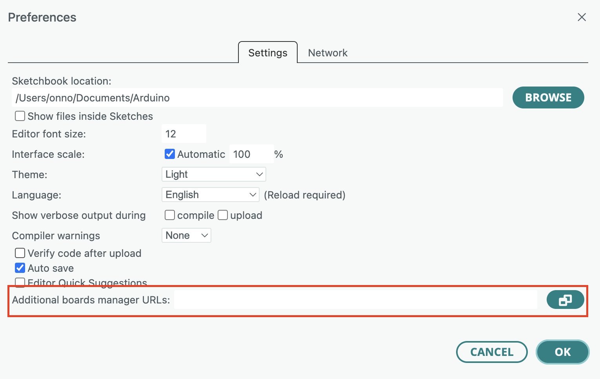
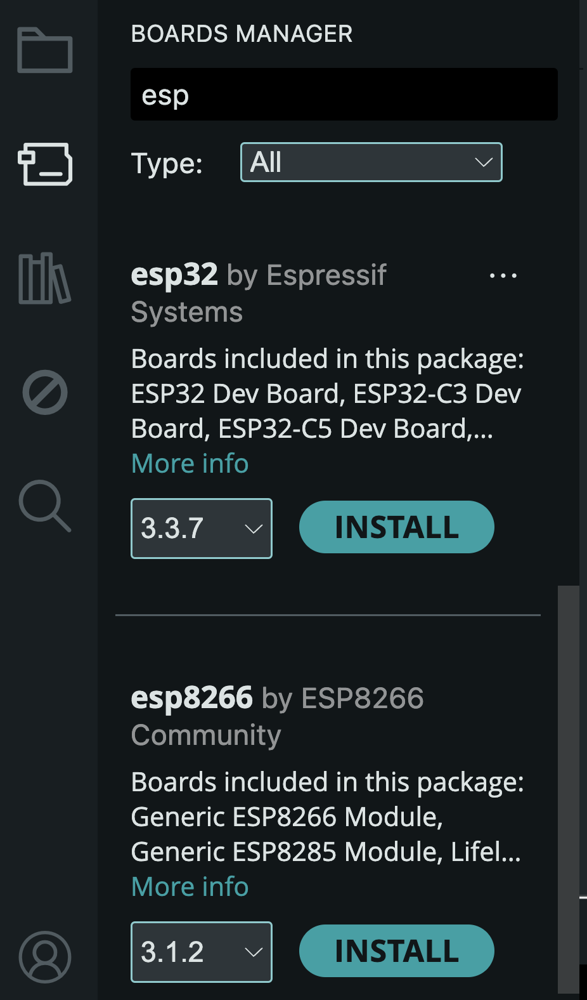

# Arduino

## Board URLs

The Arduino IDE natively supports Arduino board, which is to be expected ;-)

In order to select the right ESP board, they first have to be installed. The [Boards Manager](https://docs.arduino.cc/software/ide-v2/tutorials/ide-v2-board-manager/) needs to know where to get that information.

First open up the preferences/settings dialog by pressing ⌘ , (Command comma, or Control comma on Windows)



and put the following in the **Additional Boards manager URLs** field

```
https://dl.espressif.com/dl/package_esp32_index.json
https://arduino.esp8266.com/stable/package_esp8266com_index.json
```

Then head over to the boards manager itself, filter on _esp_ and click the 'Install' button.



This will not only add the ESP boards to the list, but also installs the tool chain needed.

Note that on MacOS you may need to install the [Xcode Command Line Tools](https://developer.apple.com/documentation/xcode/installing-the-command-line-tools)

```shell
xcode-select --install
```
