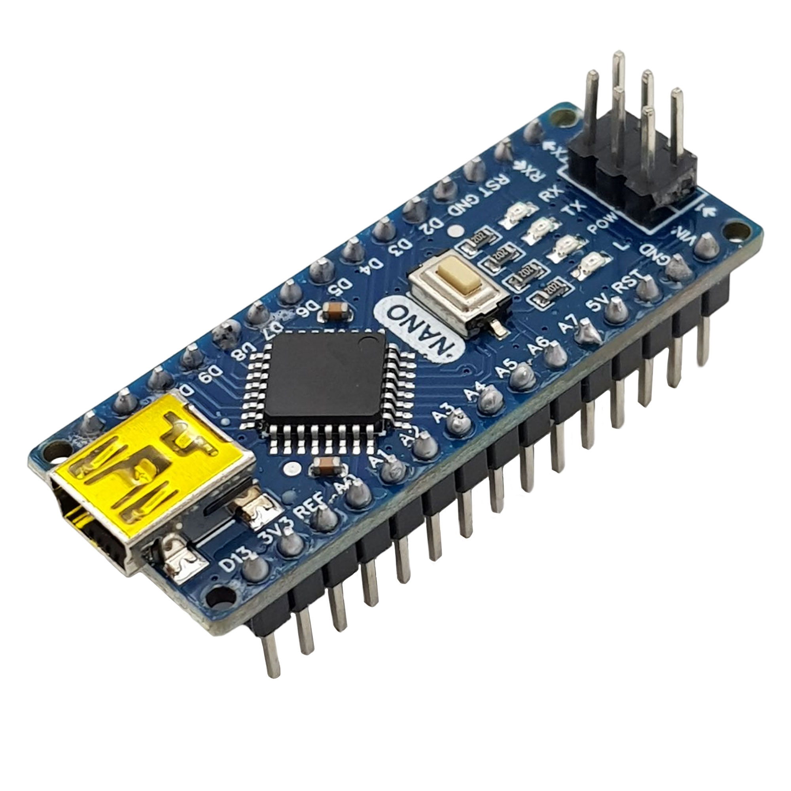
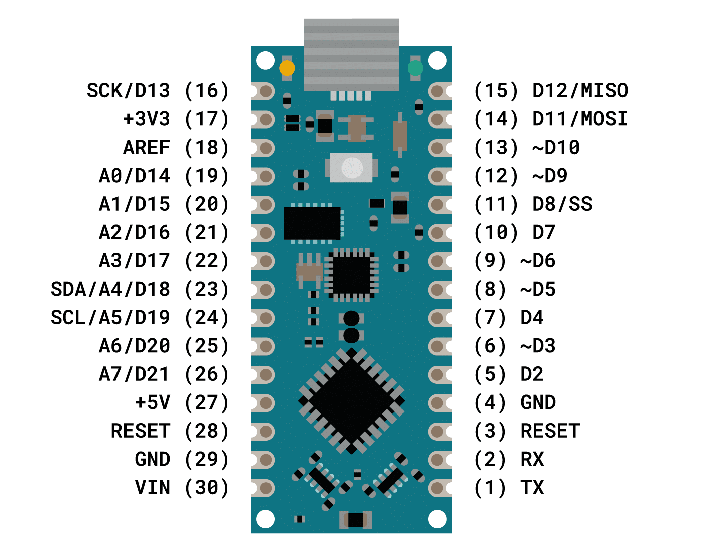
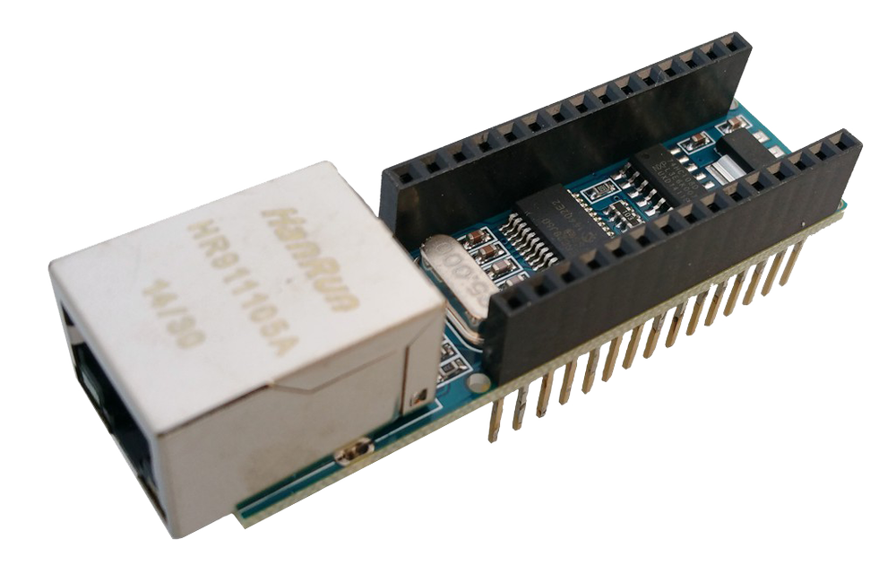

# Box A - Arduino Nano

https://docs.cirkitdesigner.com/component/e7386750-dad1-47c0-a085-a0f5d25fbda9

## Pinout

## Package Contents

- 1x Arduino Nano
- 1x USB-A to Mini-USB cable
- 1x USB-C to USB-A adapter
- 1x 170 pins mini breadboard
- 1x mini push button
- 1x Piezo Buzzer
- 1x 10 kΩ resistor
- 3x 270 Ω resistors
- 1x Light Dependent Resistor (LDR)
- 1x RGB LED
- 5x LEDs (red, green, blue, yellow, white)
- 1x GY68/BMP180/BME-BMP280 Temperature and Humidity Sensor
- 1x SW-420 Vibration Sensor
- 1x TTP223B Touch Sensor
- 1x ENC528J60 Ethernet Shield
- 1x RGB WS2812 8-Bit LED Ring
- 1x Raindrop Sensor set
- 1x TM1637 4-Digit LED 7-Segment Display
- 1x Rotary Encoder Switch

## ENC528J60 Ethernet Shield

## Library

### Arduino

https://docs.arduino.cc/libraries/ethernet/

### PlatformIO

https://registry.platformio.org/libraries/jandrassy/EthernetENC

### Source Code

https://github.com/Networking-for-Arduino/EthernetENC
