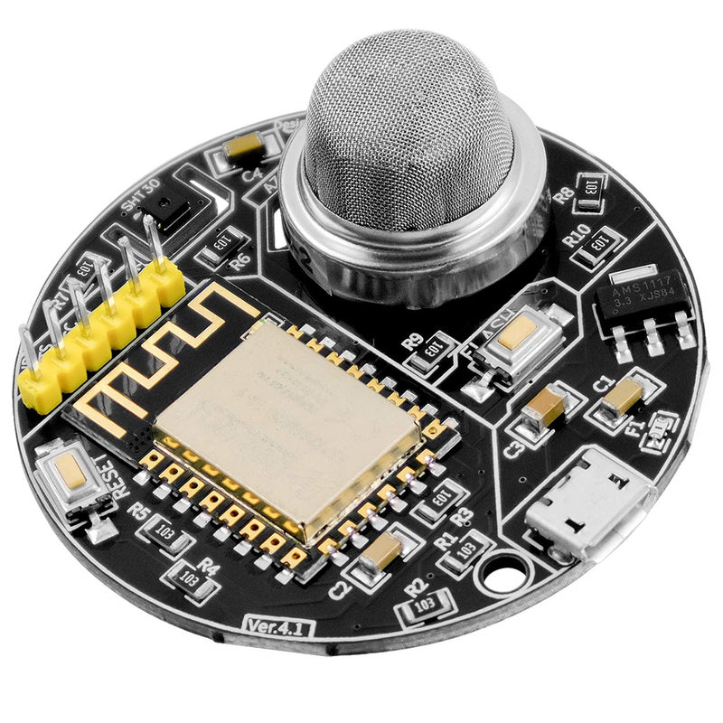
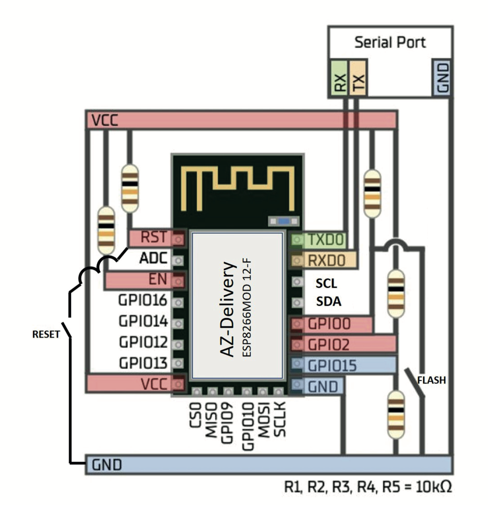

# Box B - AZ-Delivery Envy

[AZ-Envy - the somewhat different Micro Controller Board](https://www.az-delivery.de/blogs/az-delivery-blog-en/az-envy-the-somewhat-different-micro-controller-board)

[Article]https://www.az-delivery.de/en/products/az-envy
[Data Sheet](assets/doc/AZ-Envy_Datasheet.pdf)
[Manual](assets/doc/Manual_AZ-Envy_Ver.1.0_EN.pdf)
[Pinout](assets/doc/AZ-Envy_Pinout.pdf)
[3D Print Case](assets/doc/3D_print.zip)

> The board does not have an UART so programming requires hooking up a USB to TTL adapter.

## Pinout

> The GPIO points are exposed by wires that are soldered on. Make sure to check the connection. // TODO

> Only the 3V3 is provided, so you'll need to connect a Logic Level Converter in order to get 5V.

## Package Contents

- 1x AZ-Delivery Envy board (with MQ2 and SHT30)
- 1x USB to TTL adapter
- 1x USB-A to MicroUSB cable
- 2x USA-A to USB-C adapter
- 2x 170 point breadboard (10 rows x 17 columns)
- 1x Logic Level Converter
- 1x 10 kΩ resistor (brown, black, orange, gold)
- 3x 470 Ω resistor (red, red, brown, gold)
- 1x Light Dependent Resistor (LDR)
- 5x LEDs (red, green, blue, yellow, white)
- 1x RGB LED
- 1x Colour Changing LED
- 1x Mini Push button
- 1x Piezo Buzzer
- 1x Water Sensor
- 1x DHT11 temperature and humidity sensor
- 1x HC-SR501 PIR (Passive Infrared) Motion Sensor
- 1x TTP223B Touch Sensor
- 1x HC-SR04 Ultrasonic Sensor
- 1x SSD1306 OLED Display
- some coloured Dupont cable F-F
- some coloured Dupont cable F-M
- some coloured Dupont cable M-M

## Libraries

## Example Code

## Project

https://github.com/thorsten-l/ESP8266-AZ-Envy
