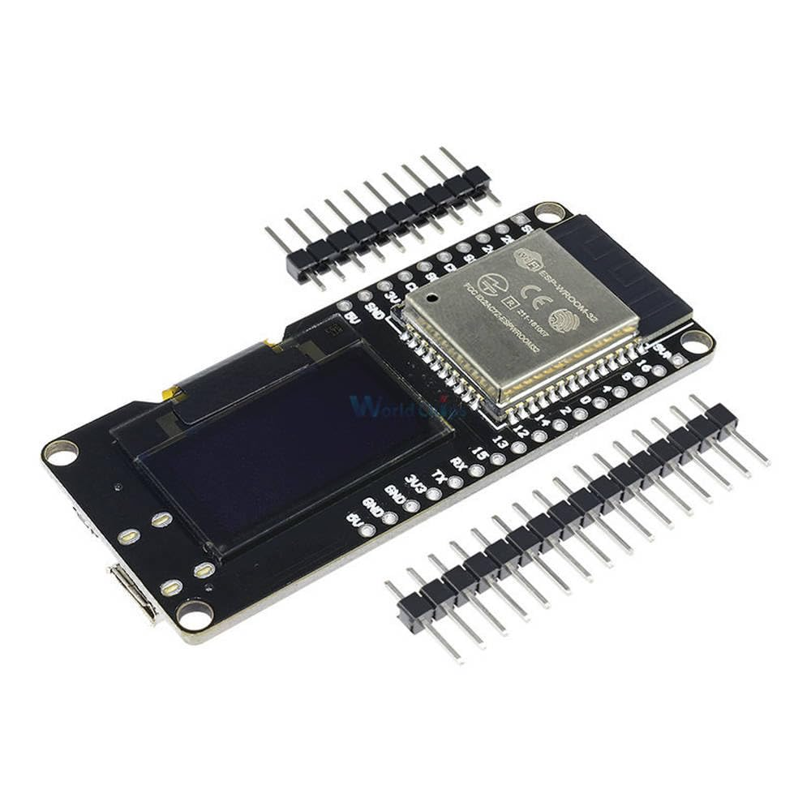
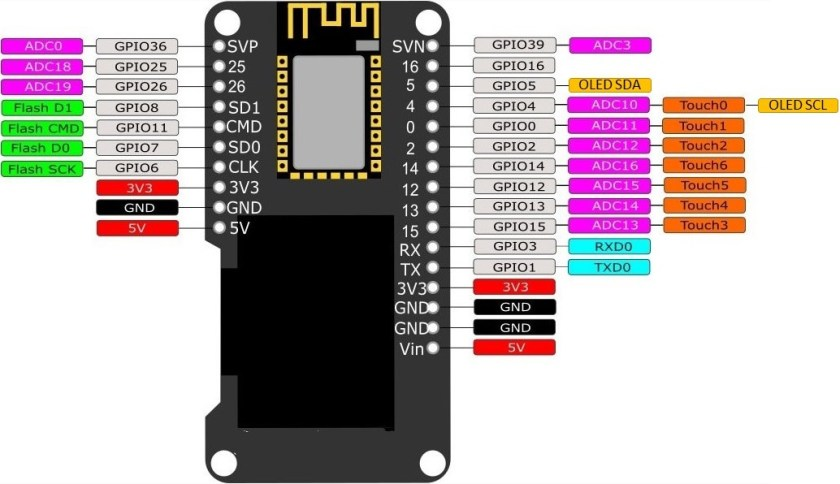

# Box C - WeMos ESP WROOM 32 OLED



https://docs.cirkitdesigner.com/component/7786fc6a-a0ee-4b72-8fc5-21d56f61b3be
https://wiki.geekworm.com/WEMOS_ESP32_Board_with_OLED

## Pinout



## Package Contents

- 1x WeMos ESP 32 development board (with SSD1306 OLED Display)
- 1x USB-A to MicroUSB cable
- 1x USA-A to USB-C adapter
- 1x [170 pins mini breadboard](../../Generic/Breadboard/README.md)
- 1x [mini push button](../../Peripherals/Switches/Button/README.md)
- 1x [Piezo Buzzer](../../Peripherals/Sound/Buzzer/README.md)
- 1x 10 kΩ resistor
- 3x 470 Ω resistor (red, red, brown, gold)
- 1x [Light Dependent Resistor (LDR)](../../Peripherals/Sensors/LDR%20Light%20Dependent%20Resistor/README.md)
- 1x [RGB LED](../../Peripherals/Lights/RGB%20LED/README.md)
- 5x [LEDs (red, green, blue, yellow, white)](../../Peripherals/Lights/Single%20Led/README.md)
- 1x [Colour Changing LED](../../Peripherals/Lights/Automatic%20Colour%20Changing%20LED/README.md)
- 1x [Water Sensor](../../Peripherals/Sensors/Water%20Sensor/README.md)
- 1x [DHT11 temperature and humidity sensor](../../Peripherals/Sensors/DHT11%20Temperature%20and%20Humidity%20Sensor/README.md)
- 1x [TTP223B Touch Sensor](../../Peripherals/Sensors/TTP223B%20Touch%20Sensor/README.md)
- 1x [HC-SR04 Ultrasonic Sensor](../../Peripherals/Sensors/HC-SR04%20Ultrasonic%20Sensor/README.md)
- 1x [SSD1306 OLED Display](../../Peripherals/Displays/SSD1306%20OLED%20Display/README.md)
- 1x [AM312 PIR (Passive Infrared) motion sensor](../../Peripherals/Sensors/AM312%20PIR%20Motion%20Sensor/README.md)
- some [Dupont Jumper cables](../../Generic/Wiring/README.md)

## Quick Start

This board has an on-board OLED screen. The following sketch displays a simple text, but of course the possibilities are (almost) endless.

```cpp
#include <Arduino.h>
#include <Wire.h>
#include <Adafruit_GFX.h>
#include <Adafruit_SSD1306.h>

#define SCREEN_WIDTH 128
#define SCREEN_HEIGHT 64

Adafruit_SSD1306 display(SCREEN_WIDTH, SCREEN_HEIGHT, &Wire, -1);

void setup() {
  Serial.begin(115200);

  // Start I2C Communication SDA = 5 and SCL = 4 on Wemos Lolin32 ESP32 with built-in SSD1306 OLED
  Wire.begin(5, 4);

  if(!display.begin(SSD1306_SWITCHCAPVCC, 0x3C, false, false)) {
    Serial.println(F("SSD1306 allocation failed"));
    for(;;);
  }
  delay(2000); // Pause for 2 seconds

  // Clear the buffer.
  display.clearDisplay();
  display.setTextSize(1);
  display.setTextColor(SSD1306_WHITE);
  display.setCursor(0, 0);
  display.print(F("Hello, World!"));
  display.display();
}

void loop() {

}
```
