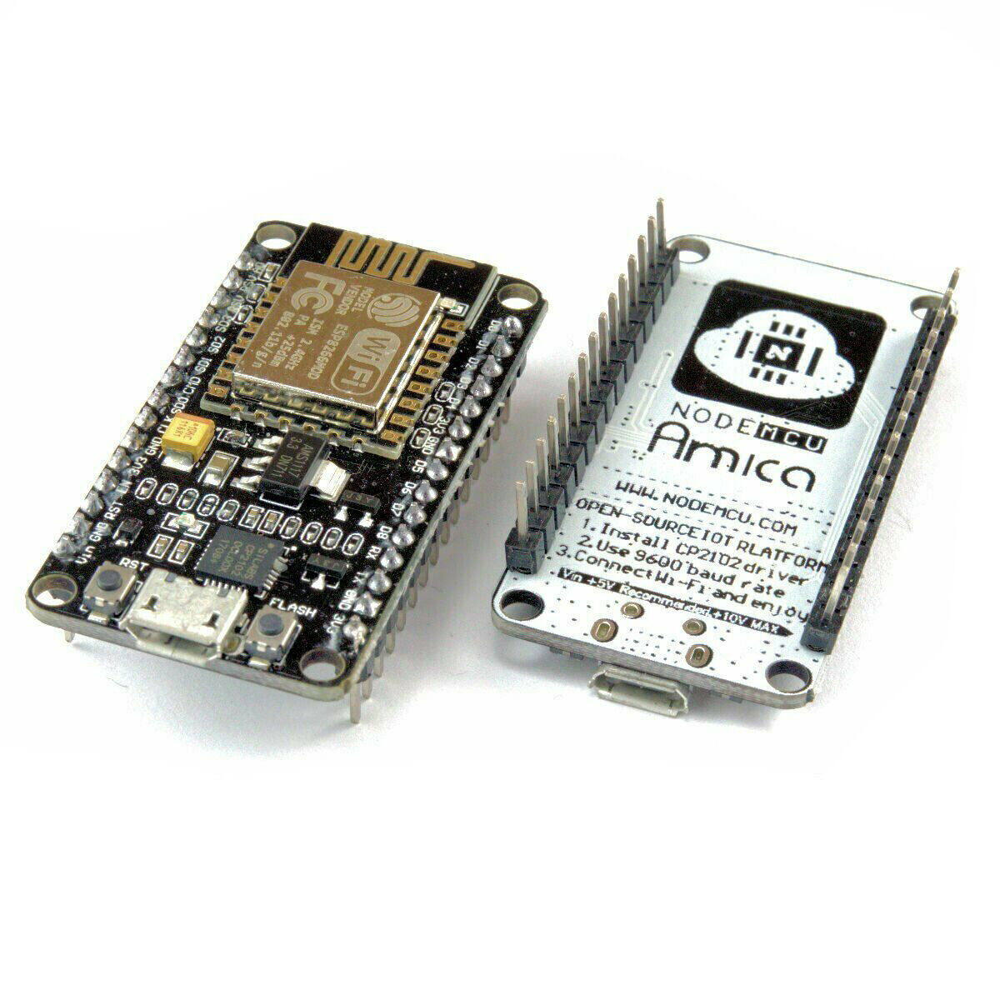
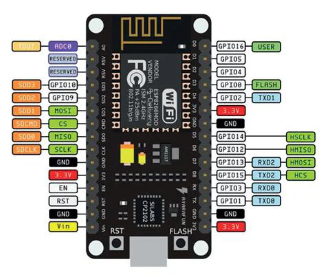

# Box D - NodeMCU



https://docs.cirkitdesigner.com/component/89e97846-8920-4a33-8e66-a4dbe70ee8b2

## Pinout



## Package Contents

- NodeMCU board
- 1x USB-A to MicroUSB cable
- 1x USA-A to USB-C adapter
- 1x [170 pins mini breadboard](../../Generic/Breadboard/README.md)
- 1x [mini push button](../../Peripherals/Switches/Button/README.md)
- 1x [Piezo Buzzer](../../Peripherals/Sound/Buzzer/README.md)
- 1x 10 kΩ resistor
- 3x 470 Ω resistor (red, red, brown, gold)
- 1x [Light Dependent Resistor (LDR)](../../Peripherals/Sensors/LDR%20Light%20Dependent%20Resistor/README.md)
- 1x [RGB LED](../../Peripherals/Lights/RGB%20LED/README.md)
- 5x [LEDs (red, green, blue, yellow, white)](../../Peripherals/Lights/Single%20Led/README.md)
- 1x [Logic Level Converter](../../Generic/Logic%20Level%20Converter/README.md)
- 1x [Colour Changing LED](../../Peripherals/Lights/Automatic%20Colour%20Changing%20LED/README.md)
- 1x [Water Sensor](../../Peripherals/Sensors/Water%20Sensor/README.md)
- 1x [DHT11 temperature and humidity sensor](../../Peripherals/Sensors/DHT11%20Temperature%20and%20Humidity%20Sensor/README.md)
- 1x [TTP223B Touch Sensor](../../Peripherals/Sensors/TTP223B%20Touch%20Sensor/README.md)
- 1x [HC-SR04 Ultrasonic Sensor](../../Peripherals/Sensors/HC-SR04%20Ultrasonic%20Sensor/README.md)
- 1x [SSD1306 OLED Display](../../Peripherals/Displays/SSD1306%20OLED%20Display/README.md)
- 1x [AM312 PIR (Passive Infrared) motion sensor](../../Peripherals/Sensors/AM312%20PIR%20Motion%20Sensor/README.md)
- some [Dupont Jumper cables](../../Generic/Wiring/README.md)

This board only has one 5V/VIN pin, so in order to connect all sensors, you'll need to create a power section on the breadboard.

## Quick Start

This board has a blue on-board LED that indicates upload activity. Also suitable for blinking every second

```cpp
#include <Arduino.h>

#define LED_PIN 2 // Onboard LED is on GPIO2

void setup() {
  pinMode(LED_PIN, OUTPUT); // Set LED pin as output
}

void loop() {
  digitalWrite(LED_PIN, LOW);  // Turn the LED on
  delay(1000);                 // Wait for 1 second
  digitalWrite(LED_PIN, HIGH); // Turn the LED off
  delay(1000);                 // Wait for 1 second
}
```
