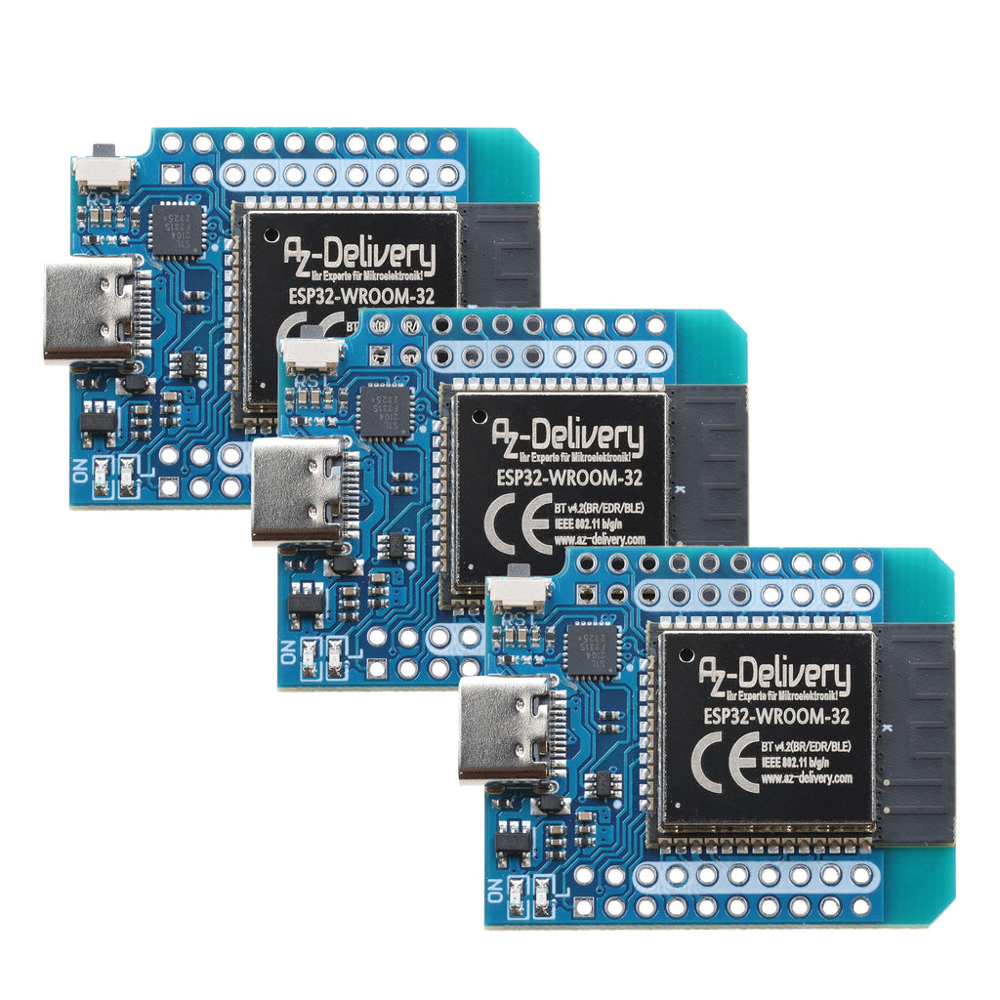
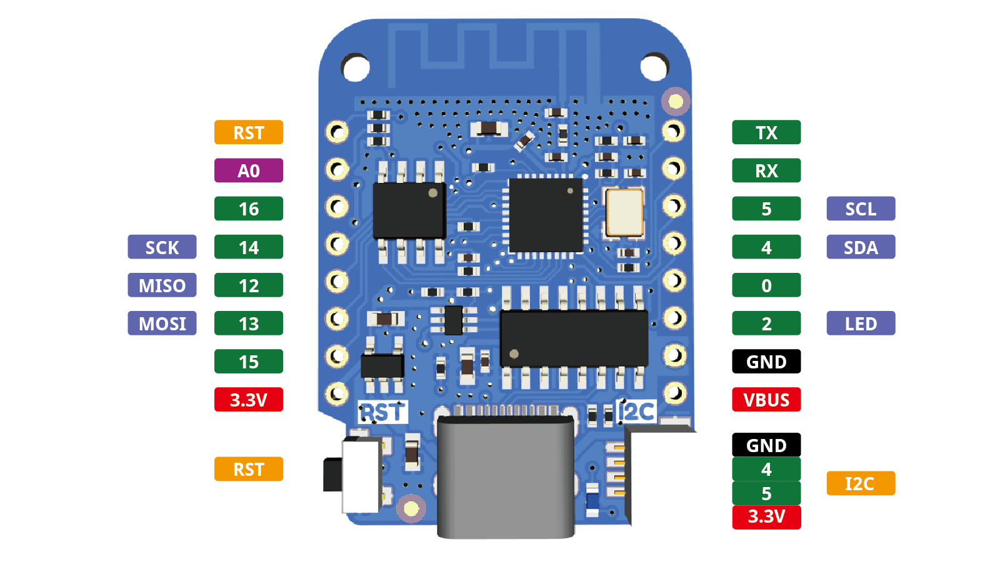

# Box E - ESP32 D1 Mini



https://docs.cirkitdesigner.com/component/3c991cf8-f243-422a-8154-81825a4c9e91

> These boards may have driver issues // TODO

## Pinout



## Package Contents

- ESP32 D1 Mini board
- 1x USB-A to MicroUSB cable
- 1x USA-A to USB-C adapter
- 1x 170 point breadboard (10 rows x 17 columns)
- 1x 10 kΩ resistor
- 3x 470 Ω resistor
- 1x LDR Light Dependent Resistor
- 3x LEDs (red, green, yellow)
- 1x RGB LED
- 1x Mini Push button
- 1x Piezo Buzzier
- 1x Water Sensor
- 1x SSD1306 OLED Display
- 1x HC-SR04 Ultrasonic Sensor
- 1x DHT11 temperature and humidity sensor
- 1x AM312 PIR (Passive Infrared) motion sensor
- 1x TTP223B Touch Sensor
- some coloured Dupont cable F-F
- some coloured Dupont cable F-M
- some coloured Dupont cable M-M

## Quick Start

This board has a blue on-board LED that indicates upload activity. Also suitable for blinking every second

```cpp
#include <Arduino.h>

#define LED_PIN D4 // Onboard LED is on GPIO2/D4

void setup() {
  pinMode(LED_PIN, OUTPUT); // Set LED pin as output
}

void loop() {
  digitalWrite(LED_PIN, LOW);  // Turn the LED on
  delay(1000);                 // Wait for 1 second
  digitalWrite(LED_PIN, HIGH); // Turn the LED off
  delay(1000);                 // Wait for 1 second
}
```
