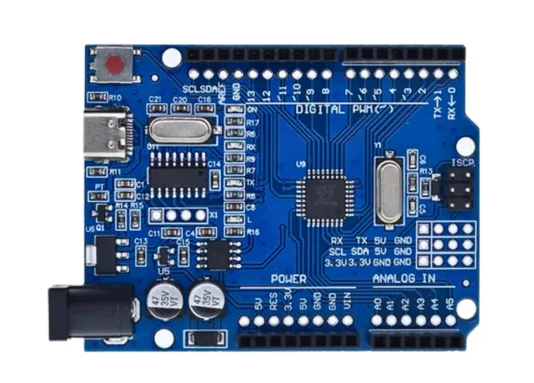
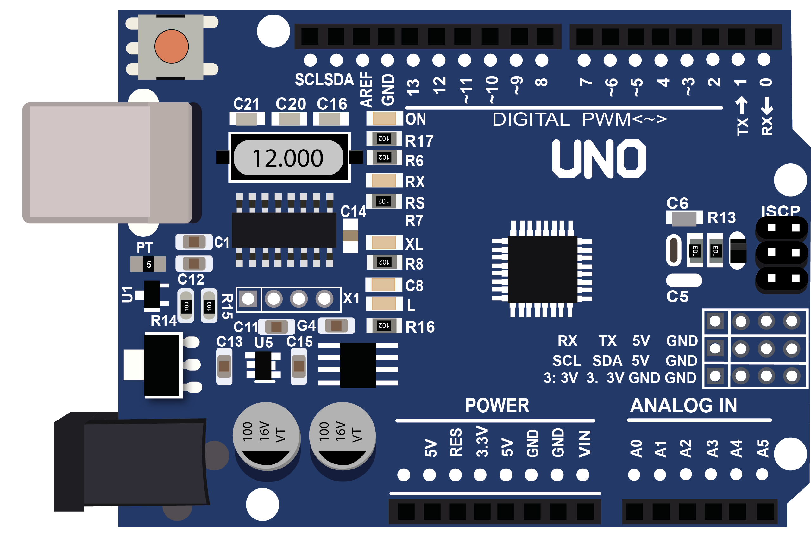
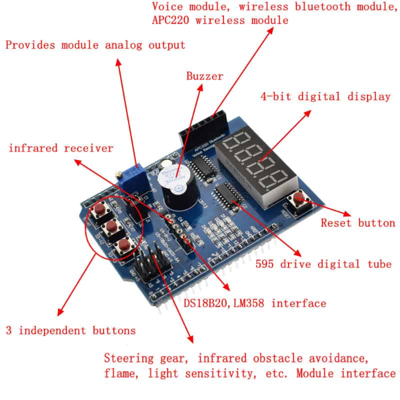

# Arduino Uno

## Pinout

## Multi-function Shield

## Library

### Arduino

https://docs.arduino.cc/libraries/multifunctionshield/

### PlatformIO

https://registry.platformio.org/libraries/coderfls/MultiFunctionShield
