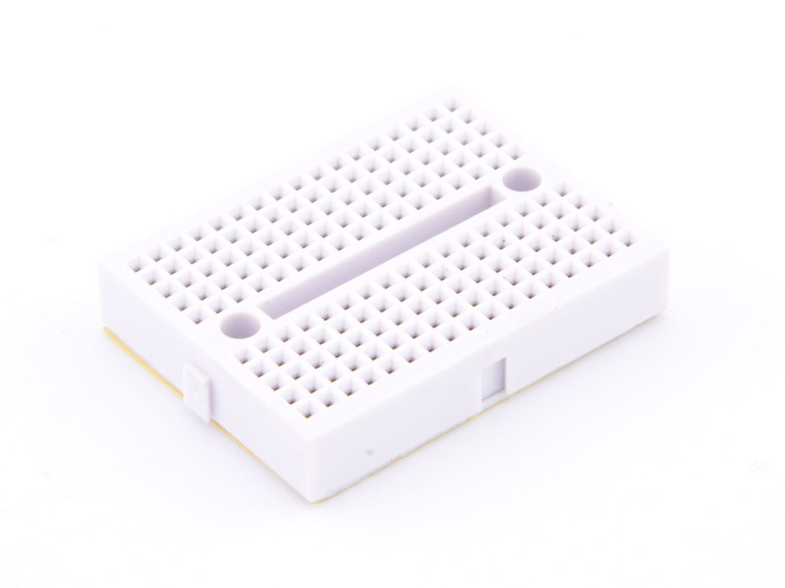
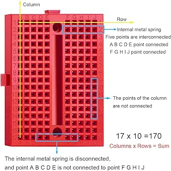
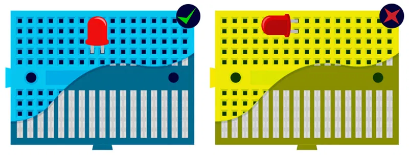
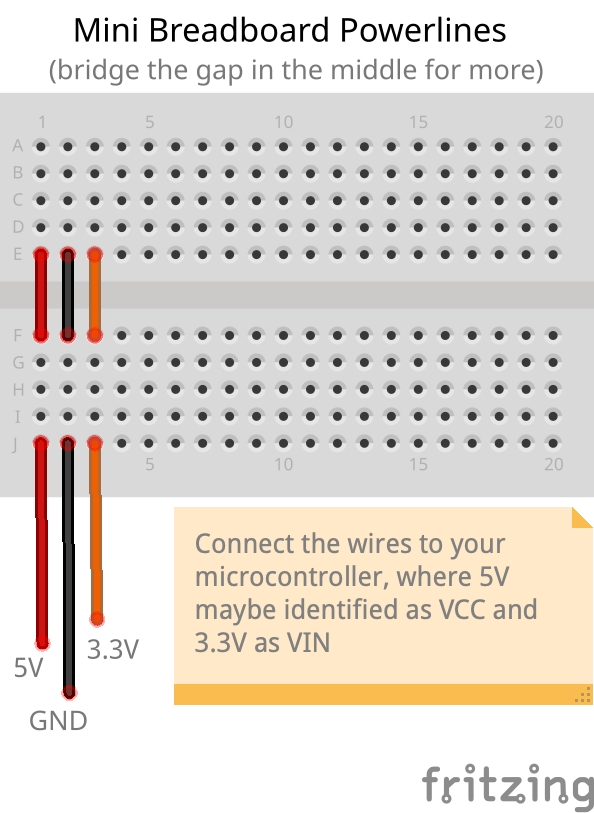

# Breadboard

Breadboards are an excellent way to prototype projects. https://en.wikipedia.org/wiki/Breadboard

## Pinout

## Wiring

## Power

Bigger breadboards usually have seperate pin lanes for providing power to the project. The mini breadboards don't have those, but can easily be created.

