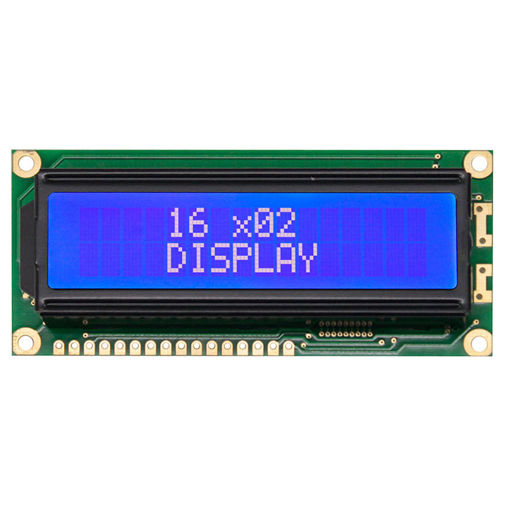
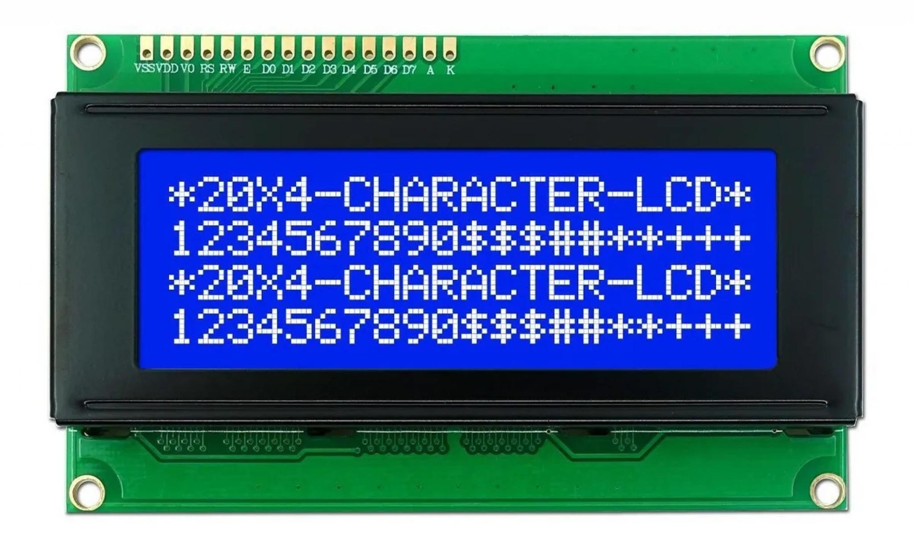
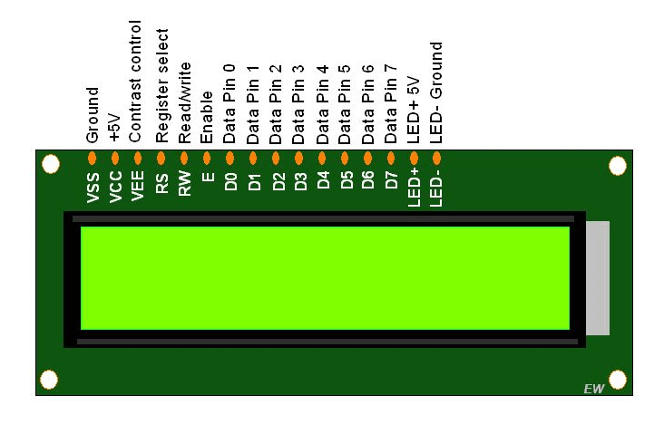
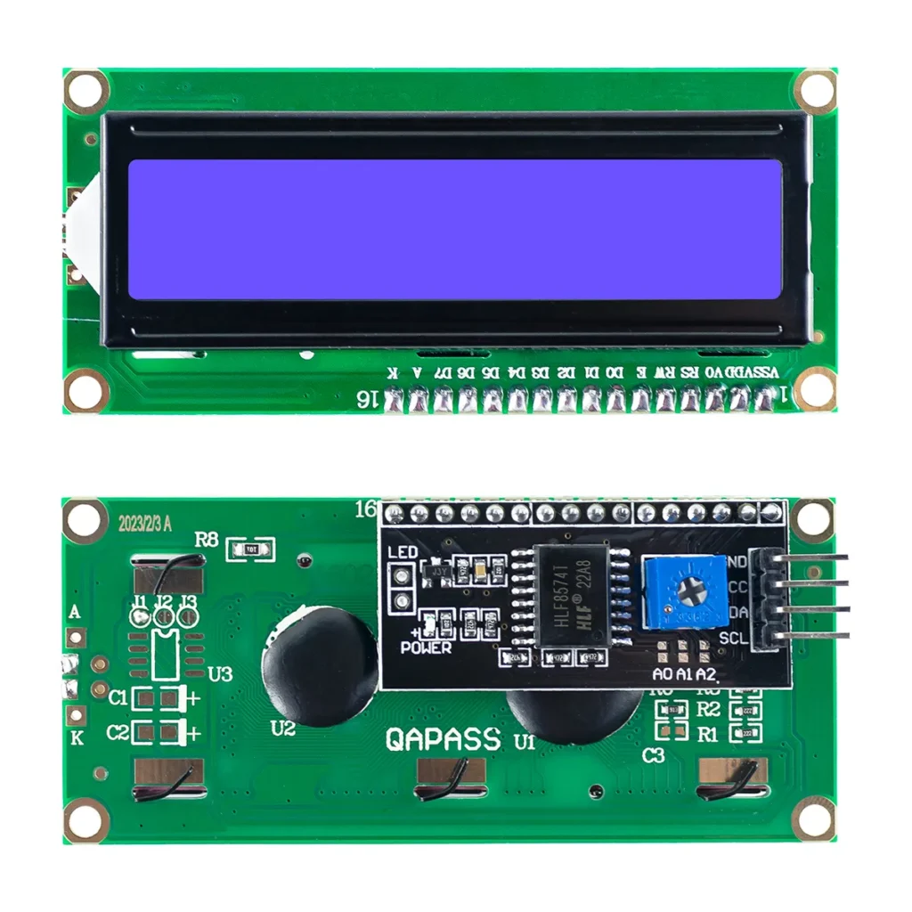
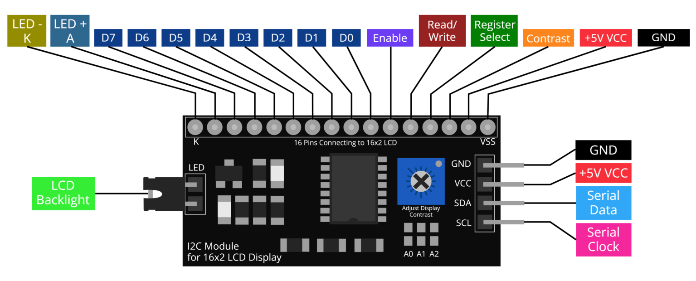

# LCD Display

There are two variations:

- 2 lines, 16 characters
  
- 4 lines, 20 characters
  

## Pinout



Many pins, but luckily connection can be simplified by soldering on an I2C controller.


And this means only 4 pins are needed to connect the display to the microcontroller in order to controller.



There's also a jumper on the side to switch on or off the backlight.

## Example Code

```cpp
#include <Arduino.h>
#include <LiquidCrystal_I2C.h>

#define I2C 0x27
#define LINES 4
#define CHARACTERS 20

LiquidCrystal_I2C lcd(I2C, CHARACTERS, LINES);

void setup()
{
    // Initialise LCD display
    lcd.init();
    lcd.backlight();
    lcd.setCursor(0, 0);
    lcd.print("Hello, world!");
    lcd.setCursor(0, 1);
    lcd.print("Nice to see you.");
    // Two extra lines available on the larger displays
    lcd.setCursor(0, 2);
    lcd.print("How do you do?");
    lcd.setCursor(0, 3);
    lcd.print("Enjoy your day.");
}

// No loop needed, unless you want to change the
// text and display a sensor reading.
void loop()
{
}
```
