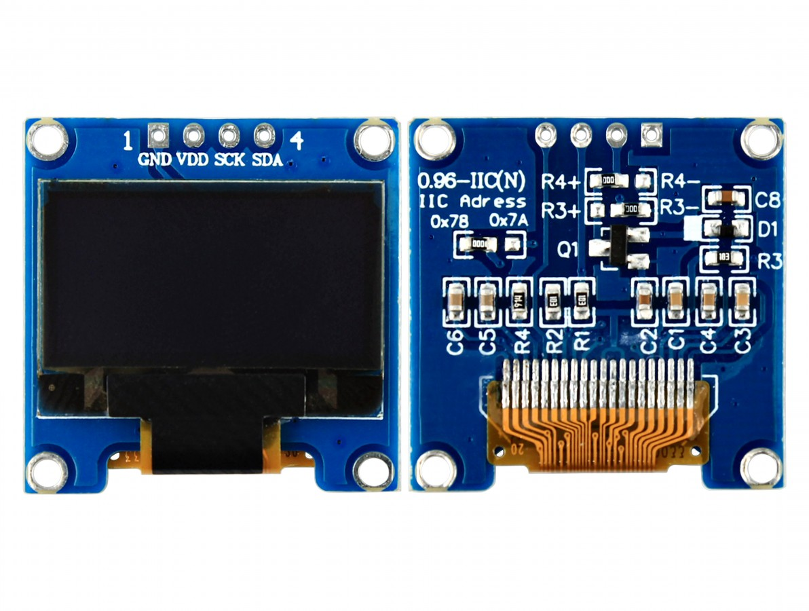
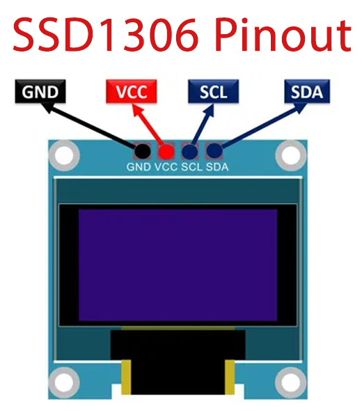

# SSD1306 OLED Display



## Pinout



## Libraries

### Arduino

https://docs.arduino.cc/libraries/ssd1306/

### PlatformIO

https://registry.platformio.org/libraries/adafruit/Adafruit%20SSD1306

### Source Code

https://github.com/adafruit/Adafruit_SSD1306

## Example Code

```cpp
#include <Wire.h>
#include <Adafruit_SSD1306.h>
#include <Adafruit_GFX.h>

// OLED display TWI address
#define OLED_ADDR   0x3C

Adafruit_SSD1306 display(-1);

#if (SSD1306_LCDHEIGHT != 64)
#error("Height incorrect, please fix Adafruit_SSD1306.h!");
#endif

void setup() {
  // initialize and clear display
  display.begin(SSD1306_SWITCHCAPVCC, OLED_ADDR);
  display.clearDisplay();
  display.display();

  // display a pixel in each corner of the screen
  display.drawPixel(0, 0, WHITE);
  display.drawPixel(127, 0, WHITE);
  display.drawPixel(0, 63, WHITE);
  display.drawPixel(127, 63, WHITE);

  // display a line of text
  display.setTextSize(1);
  display.setTextColor(WHITE);
  display.setCursor(27,30);
  display.print("Hello, world!");

  // update display with all of the above graphics
  display.display();
}

void loop() {
}
```

## Design Screen

https://arduinogfxtool.netlify.app/
