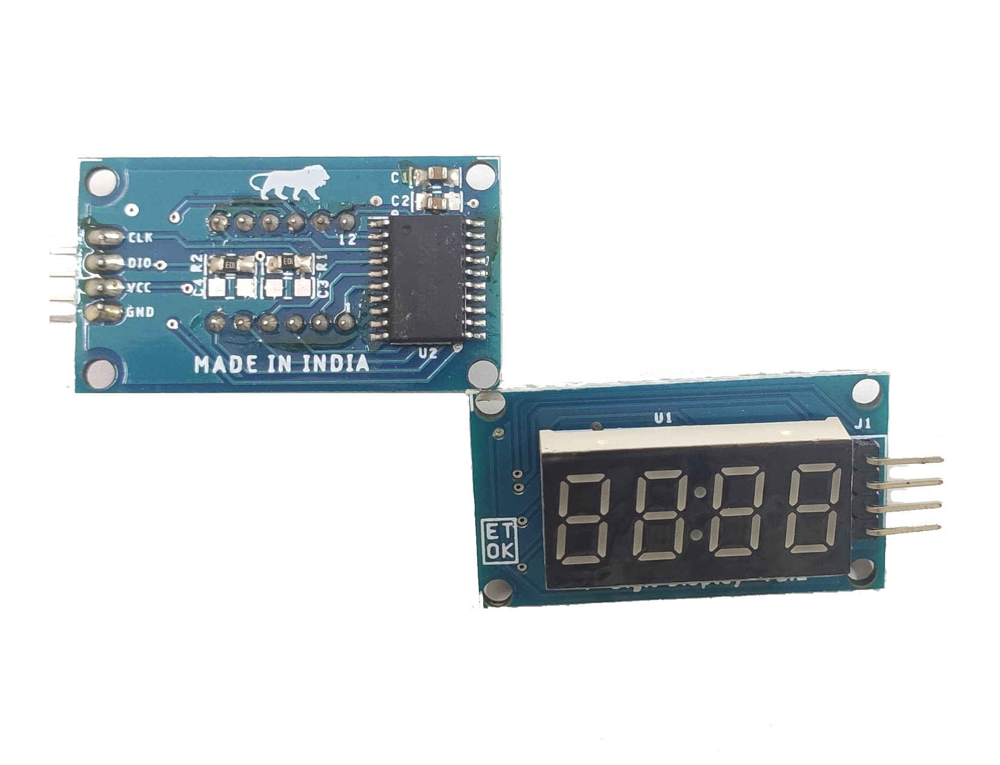
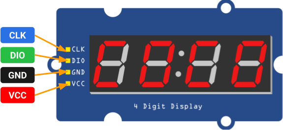

# TM1637 4-Digit LED 7-Segment Display



## Pinout



## Libraries

### Arduino

https://docs.arduino.cc/libraries/tm1637/

### PlatformIO

https://registry.platformio.org/libraries/robtillaart/TM1637_RT

### Source Code

https://github.com/avishorp/TM1637

## Example Code

```cpp
#include "TM1637.h"

TM1637 TM;

uint32_t start, stop;

void setup()
{
  while(!Serial);
  Serial.begin(115200);
  Serial.println();
  Serial.println(__FILE__);
  Serial.print("TM1637_LIB_VERSION: ");
  Serial.println(TM1637_LIB_VERSION);
  Serial.println();

  TM.begin(7, 6, 4);       //  clock pin, data pin, #digits

  delay(10);
  start = micros();
  TM.displayTime(59, 59, true);
  stop = micros();
  Serial.println(stop - start);
}


void loop()
{
  uint32_t now = 523 + millis() / 1000;
  uint8_t hh = now / 60;
  uint8_t mm = now - hh * 60;
  bool colon = (millis() % 1000 < 500);
  TM.displayTime(hh, mm, colon);
}
```
