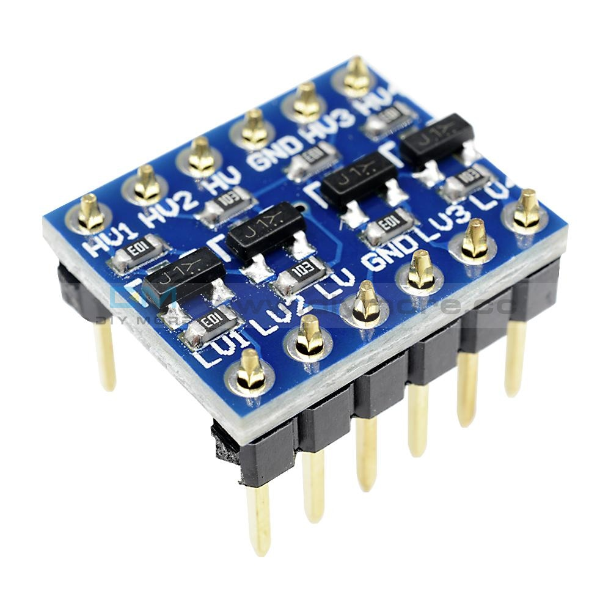
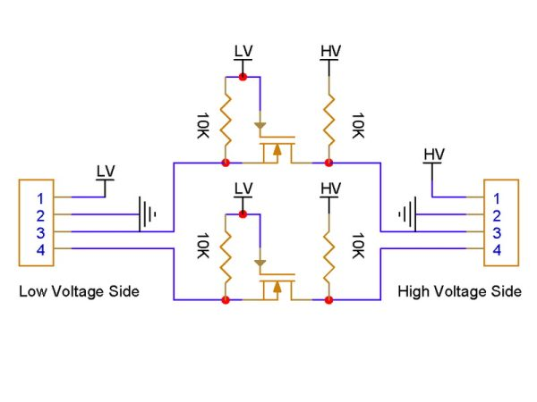
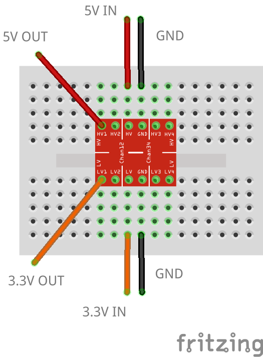

# Logic Level Converter

Sometimes you need 5V for a sensor and you only have 3.3V on your microcontroller, or vice versa. Then a LLC comes in handy, that can convert High Voltage (HV) to Low Voltage (LV), and vice versa.

## Circuit

Connect the microcontroller's 3.3V pin to LV, the 5V to HV and the ground to both GND. Then draw either 5V from HVx or 3.3V from LVx, where x depends on the number of channels the PCB has.

https://learn.sparkfun.com/tutorials/bi-directional-logic-level-converter-hookup-guide/all

## Wiring Scheme

