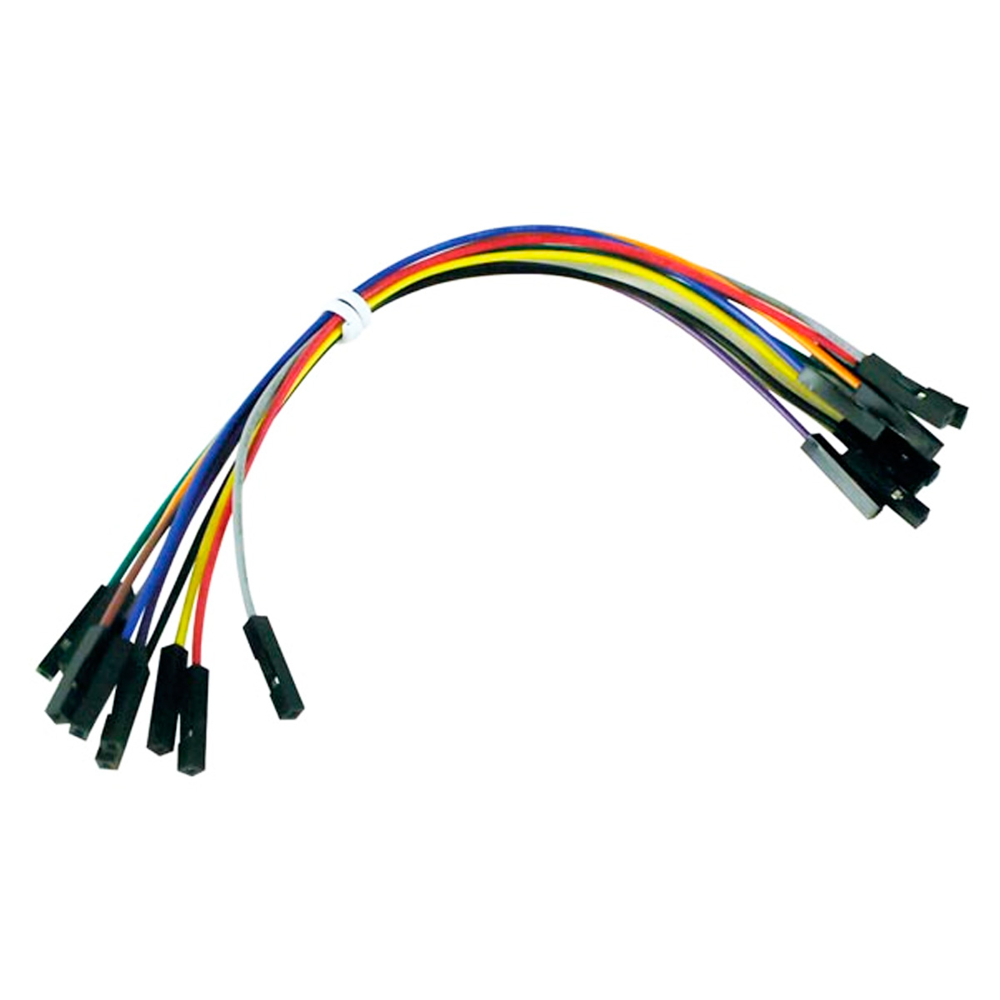
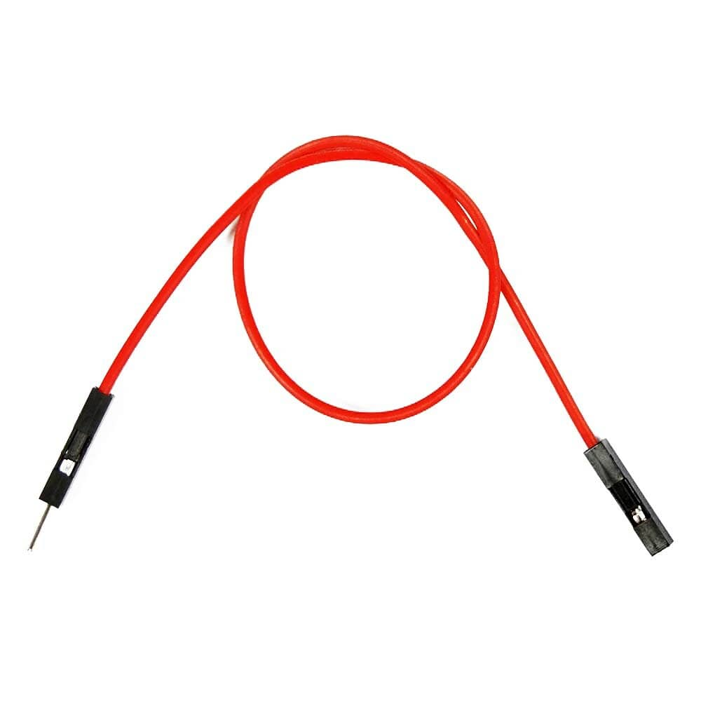
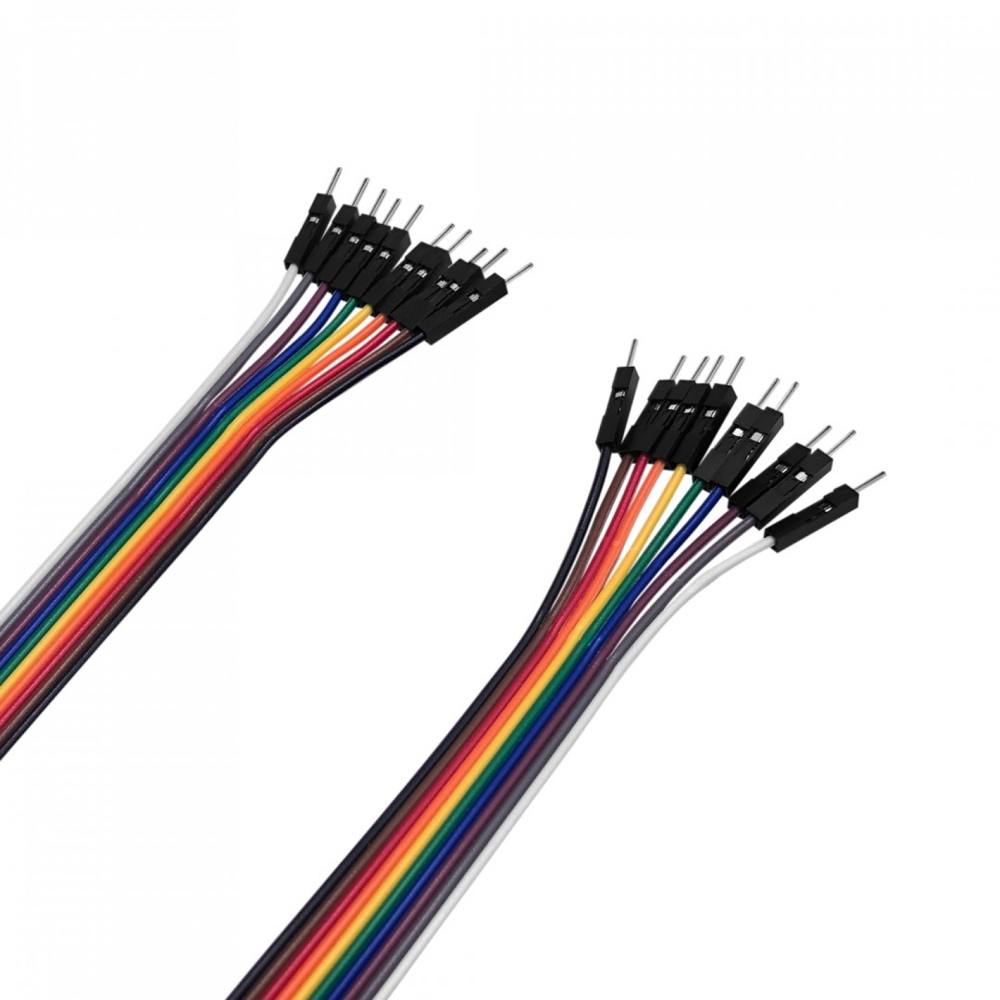

# Wiring

Connecting peripherals to the microcontroller can be a tricky thing. Since the microcontrollers used are targeting the development stage, you don't want to solder and de-solder everything you want to hook up something new. Luckily Dupont jumper cables will help in that department.

They come in all colors and sizes and connect either a sensor pin to the controller pin (female to female),

connect a sensor or controller pin to the breadboard (female to male),

or one point on the breadboard to another (male to male)

