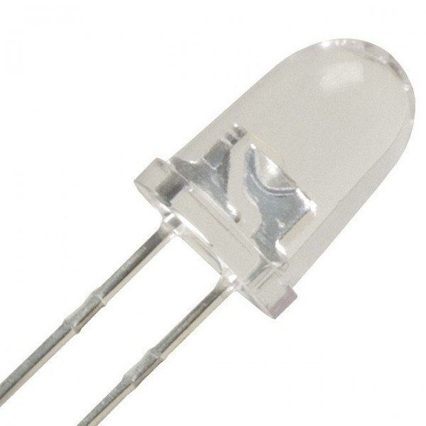
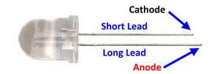
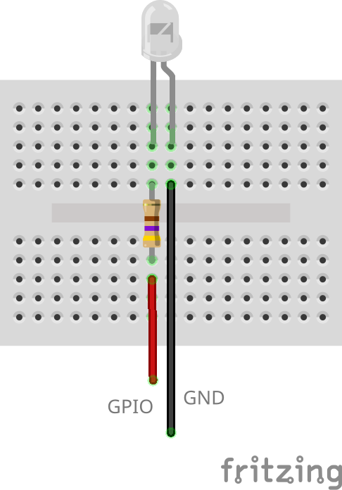
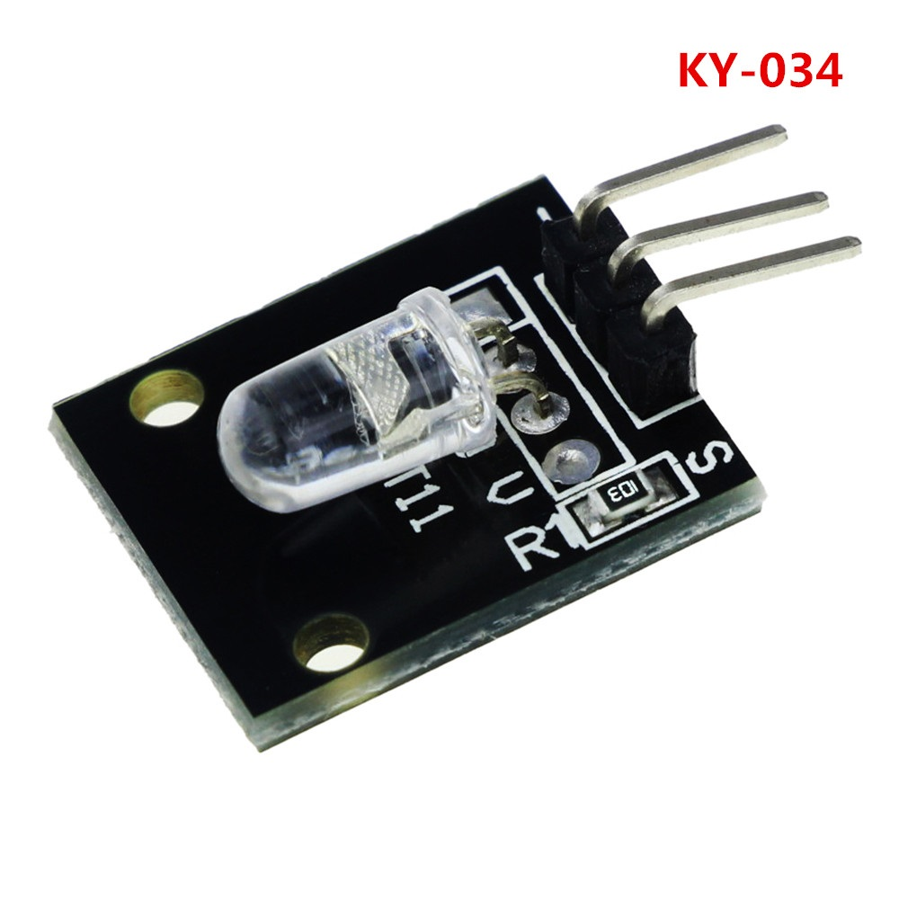
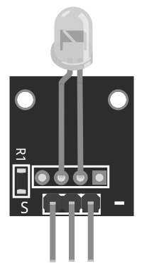

# Automatic Colour Changing LED



This looks like an ordinary white LED until you plug it in. You'll notice an automatic colour change. Sadly you can't change the colours or the speed in which they change. For that you'll need an RGB LED.

## Pinout



## Wiring Scheme



The LED may also come as a SY-034 module already mounted with a resistor.





In this case the S pin on the module goes to the GPIO pin on the controller and the - pin should be connected to the ground.

## Example Code

```cpp
#include <Arduino.h>

int ledPin = 15;

void setup()
{
    Serial.begin(115200);
    pinMode(ledPin, OUTPUT);
}

void loop()
{
    digitalWrite(ledPin, HIGH);
    delay(10000);
    digitalWrite(ledPin, LOW);
    delay(5000);
}
```
