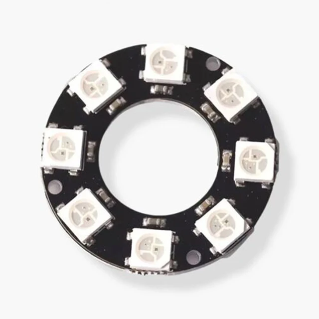
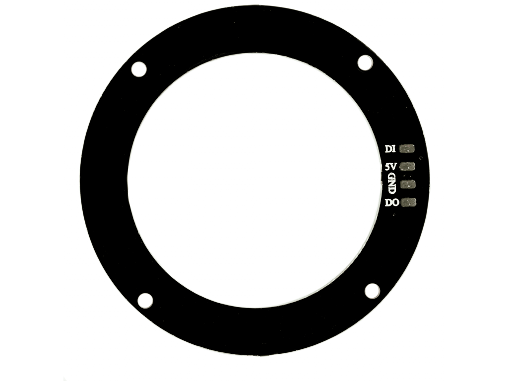

# RGB WS2812 8-Bit LED Ring



## Pinout



Connect 5V (red wire) and GND (black wire) to the corresponding pins on the microcontroller. DI (yellow wire, data in) is the controlling pin. DO (not connected, data out) can be connected to a DI pin on another ring in order to chain multiple LED rings together.

## Libraries

### Arduino

https://docs.arduino.cc/libraries/adafruit-neopixel/

### PlatformIO

https://registry.platformio.org/libraries/adafruit/Adafruit%20NeoPixel

### Source Code

https://github.com/adafruit/Adafruit_NeoPixel

## Example Code

```cpp
#include <Arduino.h>
#include <Adafruit_NeoPixel.h>

#define LED_PIN 6
#define LED_COUNT 8

Adafruit_NeoPixel ring(LED_COUNT, LED_PIN, NEO_GRB + NEO_KHZ800);

void setup() {
  ring.begin();        // Initialize the LED ring
  ring.show();         // Turn off all LEDs initially
}

void loop() {
  for (int i = 0; i < LED_COUNT; i++) {
    ring.setPixelColor(i, ring.Color(255, 0, 0)); // Set each LED to red
  }
  ring.show();         // Update the ring to apply color
}
```
