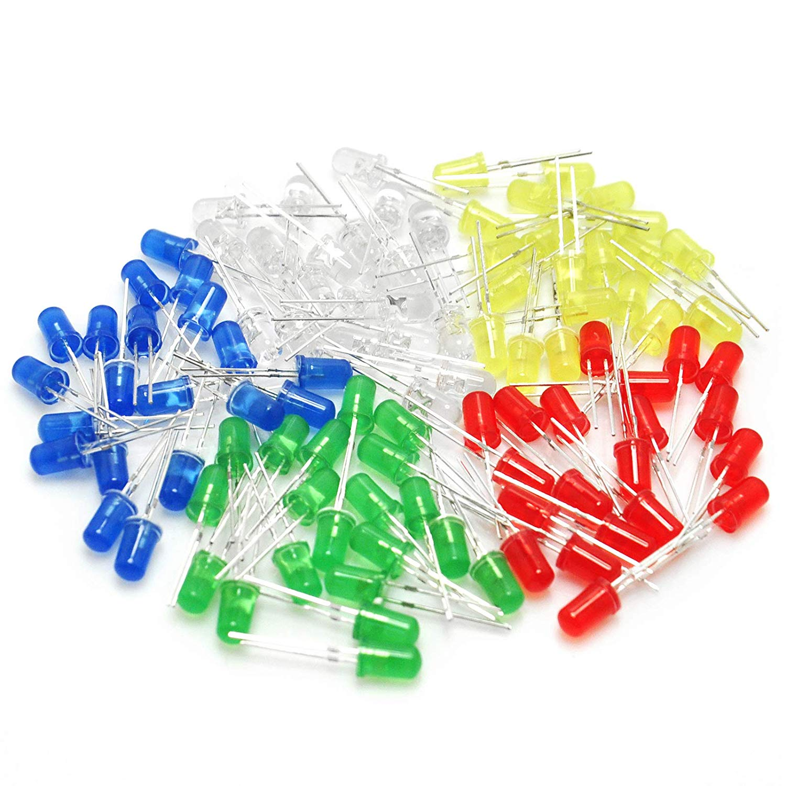
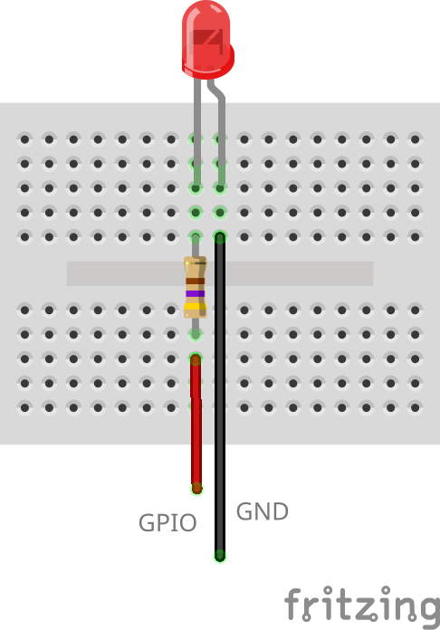
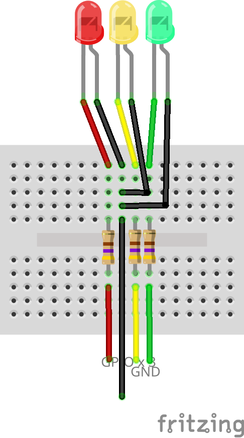

# Blinking LED

The 'Hello World' of microcontroller programming. They come in all shapes, sizes en colours.



## Pinout


## Wiring Scheme



## Example Code

```cpp
#include <Arduino.h>

int ledPin = 15;

void setup()
{
    Serial.begin(115200);
    pinMode(ledPin, OUTPUT);
}

void loop()
{
    digitalWrite(ledPin, HIGH);
    delay(1000);
    digitalWrite(ledPin, LOW);
    delay(1000);
}
```

## Traffic Lights



```cpp
#include <Arduino.h>

// const int PIN_RED = 27;   // Red LED on pin 9
// const int PIN_GREEN = 32; // Green LED on pin 10
// const int PIN_BLUE = 25;  // Blue LED on Pin 11

const int red = 27;
const int yellow = 32;
const int green = 25;
/**
 * @brief Arduino setup function
 *
 * This function runs once when the Arduino starts.
 * It configures the LED pins as output.
 */
void setup()
{
  pinMode(red, OUTPUT);    ///< Configure red LED pin as output
  pinMode(yellow, OUTPUT); ///< Configure yellow LED pin as output
  pinMode(green, OUTPUT);  ///< Configure green LED pin as output
}
/**
 * @brief Arduino main loop function
 *
 * This function runs continuously after setup().
 * It turns ON each LED in sequence to mimic
 * a real traffic light system.
 */
void loop()
{
  digitalWrite(green, HIGH);  ///< Turn Green LED ON
  delay(8000);                ///< Keep Green ON for 8 seconds
  digitalWrite(green, LOW);   ///< Turn Green LED OFF
  digitalWrite(yellow, HIGH); ///< Turn Yellow LED ON
  delay(1000);                ///< Keep Yellow ON for 1 seconds
  digitalWrite(yellow, LOW);  ///< Turn Yellow LED OFF
  digitalWrite(red, HIGH);    ///< Turn Red LED ON
  delay(8000);                ///< Keep Red ON for 8 seconds
  digitalWrite(red, LOW);     ///< Turn Red LED OFF
  digitalWrite(yellow, HIGH); ///< Turn Yellow LED ON
  delay(1000);                ///< Keep Yellow ON for 1 seconds
  digitalWrite(yellow, LOW);  ///< Turn Yellow LED OFF
}
```

Of course you can change the sequence to follow the pattern of a country to your liking.
