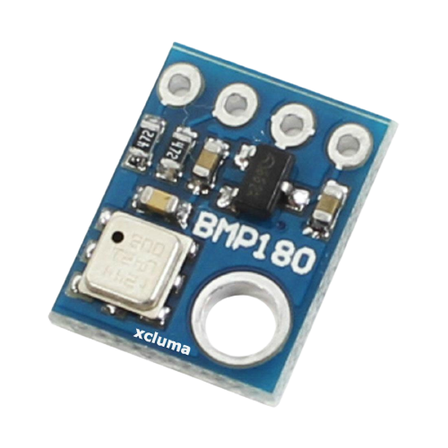
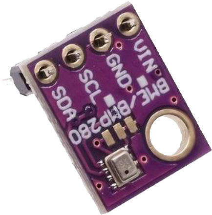
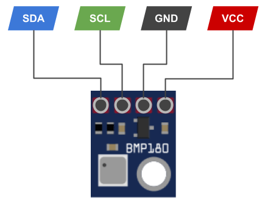
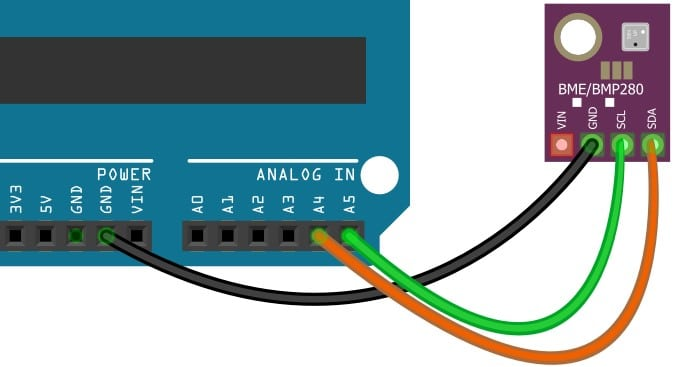

# BMP180 / BMP280 / BME280 / GY Temerature and Humidity Sensor



https://componentslibrary.com/bosch-bmp180-datasheet.html



https://wiki.openelab.io/sensors/bme280-humidity-pressure-temperature-sensors

## Pinout

Pinout for all types are mostly identical. Check the writing on the PCB!



## Wiring Scheme

Hooking up the sensor to the microcontroller is also done in a similar fashion.



## Example Code

```cpp

```
