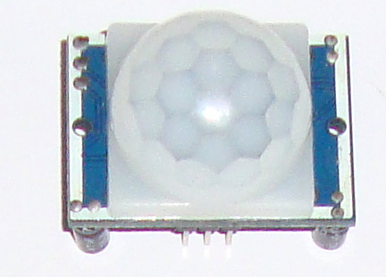
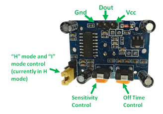

# HC-SR501 PIR Motion Sensor



## Pinout



## Quick Start

```cpp
#include <Arduino.h>

int pirPin = 12;   // Pin voor de HC-S501 sensor
int pirValue;      // Uitgelezen sensor waarde

void setup() {
  Serial.begin(115200); // Start seriële communicatie
  pinMode(pirPin, INPUT);     // Stel de pirPin in als invoer
}

// Herhaal oneindig
void loop() {
  pirValue = digitalRead(pirPin); // Lees de waarde van de PIR uit
  if (pirValue == HIGH) { // Als er beweging is gedetecteerd
    Serial.println("Motion detected!");
  } else {
    Serial.println("No motion.");
  }
  delay(1000); // Wait for 1 second before checking again
}
```
