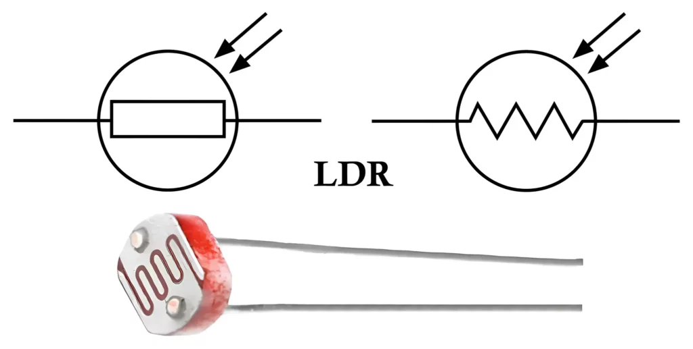
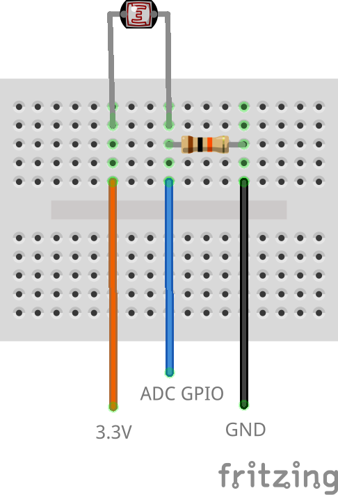

# Light Dependent Resistor (LDR)



https://en.wikipedia.org/wiki/Photoresistor

## Wiring Diagram



- Connect one end of the LDR to 3.3V on the ESP32.
- Connect the other end of the LDR to one leg of a 10kΩ resistor.
- Connect the junction between the LDR and the resistor to any ADC-compatible pin (e.g. GPIO34) on the ESP32.
- Connect the other end of the resistor to GND.

## Use Cases

- Automatic Night Lights – Turn LEDs on when it gets dark.
- Smart Blinds – Adjust window blinds based on sunlight.
- Light Data Logging – Monitor and analyze light levels over time.

## Example Code

```cpp
#include <Arduino.h>

#define LDR_PIN = 34; // Any analogue (ADC) pin will do

void setup()
{
    Serial.begin(115200);
}

void loop()
{
    int ldrValue = analogRead(LDR_PIN);
    Serial.print("LDR Value: ");
    Serial.println(ldrValue);

    // Add your logic here to interpret the LDR value and take appropriate actions

    delay(500);
}
```
