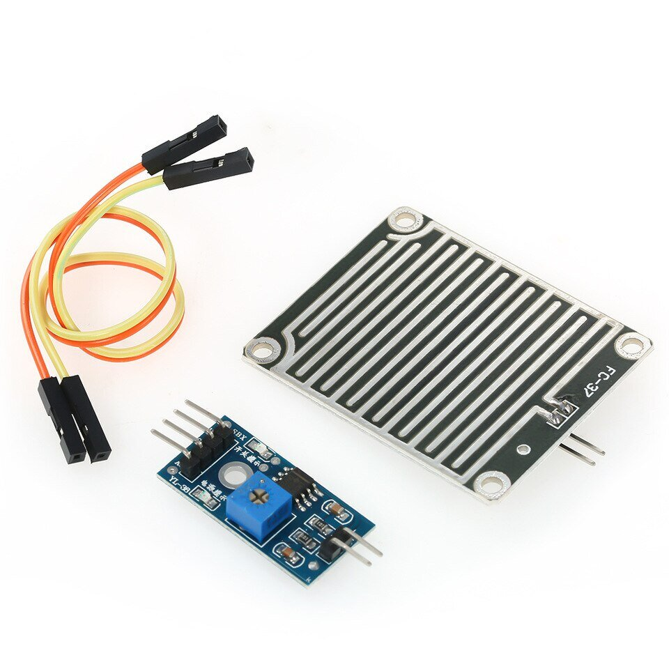
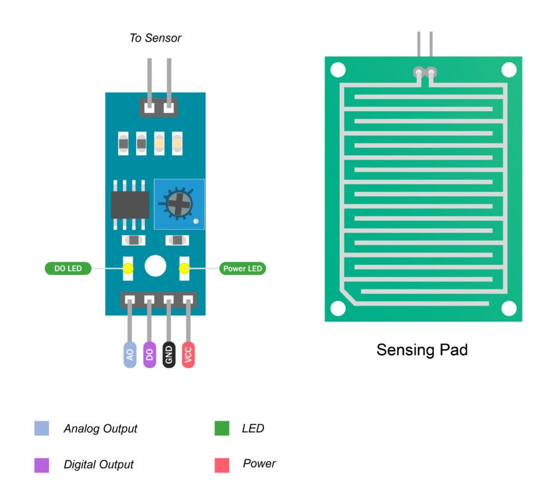
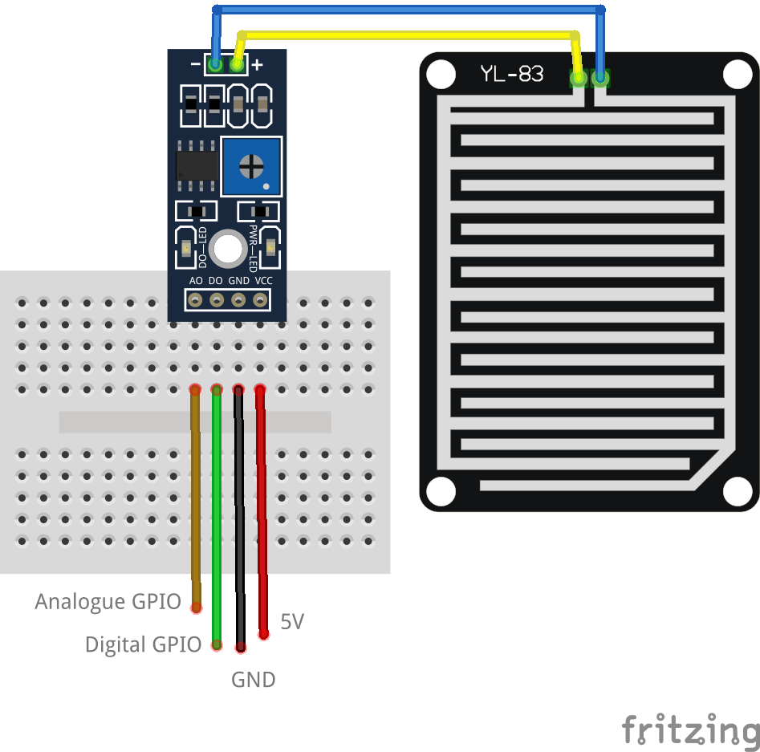

# Raindrop Sensor



## Pinout



## Wiring Scheme



## Example Code

```cpp
#define POWER_PIN 19  // pin GPIO19 that provides the power to the rain sensor
#define DO_PIN 21     // pin GPIO21 connected to DO pin of the rain sensor
#define AO_PIN 36     // pin GPIO36 connected to AO pin of the rain sensor

void setup() {
  Serial.begin(115200); // initialize serial communication
  pinMode(POWER_PIN, OUTPUT);  // configure the power pin pin as an OUTPUT
  pinMode(DO_PIN, INPUT); // initialize the digital output pin as an input
  analogSetAttenuation(ADC_11db); // set the ADC attenuation to 11 dB (up to ~3.3V input)
}

void loop() {
  digitalWrite(POWER_PIN, HIGH);  // turn the rain sensor's power ON
  delay(10);                      // wait 10 milliseconds

  int rain_state = digitalRead(DO_PIN);
  int rain_value = analogRead(AO_PIN);

  digitalWrite(POWER_PIN, LOW);  // turn the rain sensor's power OFF

  if (rain_state == HIGH)
    Serial.println("The rain is NOT detected");
  else
    Serial.println("The rain is detected");
    Serial.println(rain_value);  // print out the analog value

  delay(1000);  // pause for 1 sec to avoid reading sensors frequently to prolong the sensor lifetime
}
```
