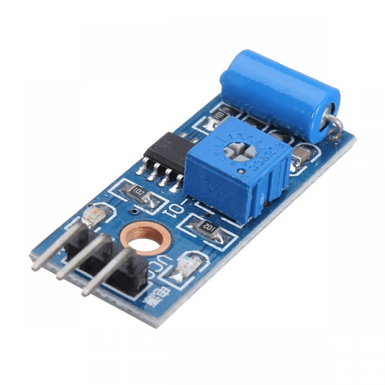
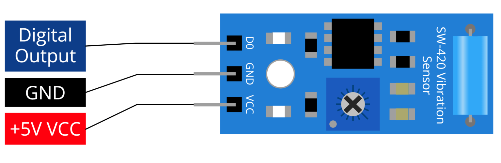
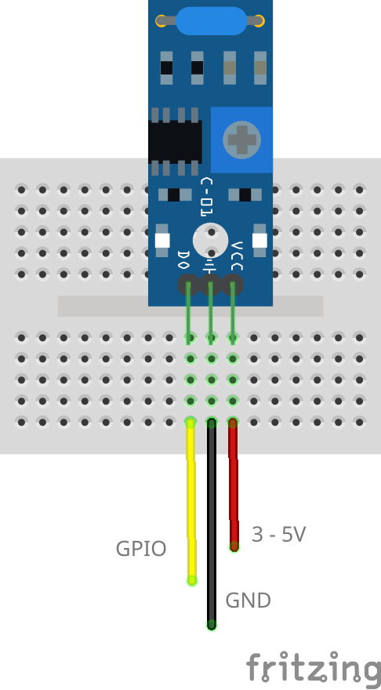

# SW-420 Vibration Sensor


https://arduwiki.com/wiki/Vibration_Sensor%28SW-420%29

## Pinout



## Wiring Scheme



## Example Code

```cpp
/*
Read the digital output value of the vibration sensor.
When a vibration is detected, the program will display the message
"Detected vibration..." on the serial monitor. Conversely,
if there is no vibration, the program will output "..." instead.

Board: ESP32 Development Board
Component: Vibration Sensor(SW-420)
*/

#include <Arduino.h>

// Define the pin numbers for Vibration Sensor
const int sensorPin = 23;

void setup()
{
Serial.begin(115200); // Start serial communication at 9600 baud rate
pinMode(sensorPin, INPUT); // Set the sensorPin as an input pin
}

void loop()
{
if (digitalRead(sensorPin))
{ // Check if there is any vibration detected by the sensor
Serial.println("Detected vibration..."); // Print "Detected vibration..." if vibration detected
}

    // Add a delay to avoid flooding the serial monitor
    delay(100);

}
```
