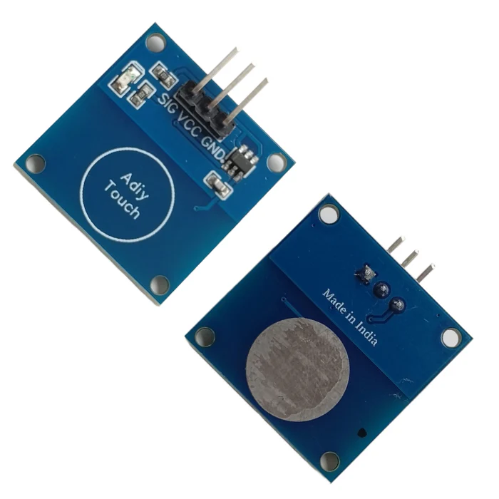
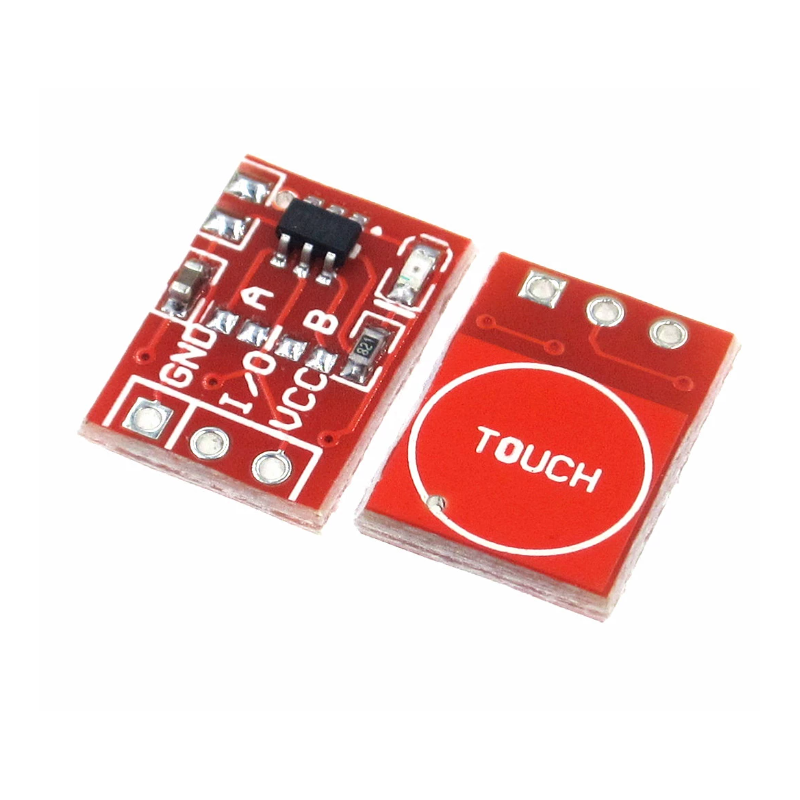
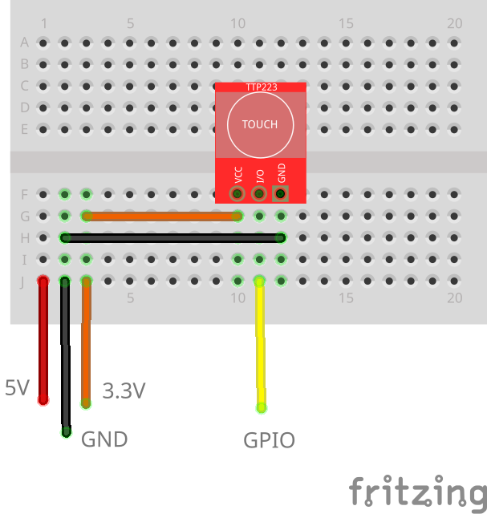

# TTP223B Touch Sensor

You can come across the blue pill variant

or the red pill variant


The red ones are slightly smaller and carry an LED which lits up when touched. Also the pinout can be different, so be sure to check the PCB for clues.

## Pinout

| Pin        | Meaning               |
| ---------- | --------------------- |
| VCC        | 3-5V                  |
| GND        | Ground                |
| SIG or I/O | Data, connect to GPIO |

## Wiring Scheme



## Example Code

```cpp
#include <Arduino.h>

const int SENSOR_PIN = 23;

int lastState = LOW; // the previous state from the input pin
int currentState;    // the current reading from the input pin

void setup()
{
    // initialise serial communication at 115200 bits per second:
    Serial.begin(115200);
    // initialise the Arduino's pin as an input
    pinMode(SENSOR_PIN, INPUT);
}

void loop()
{
    // read the state of the the input pin:
    currentState = digitalRead(SENSOR_PIN);

    if (lastState == LOW && currentState == HIGH)
        Serial.println("The sensor is touched");

    // save the the last state
    lastState = currentState;
}
```
