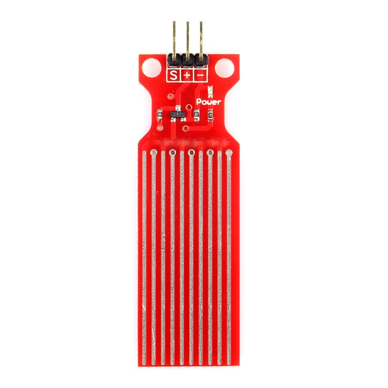
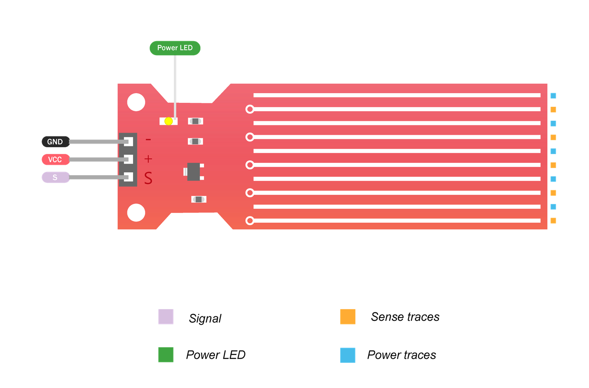

# Water Sensor



## Pinout



## Example Code

```cpp
#include <Arduino.h>

#define POWER_PIN 23  // ESP32 pin GPIO17 connected to sensor's VCC pin
#define SIGNAL_PIN 36 // ESP32 pin GPIO36 (ADC0) connected to sensor's signal pin

int value = 0; // variable to store the sensor value

void setup()
{
    Serial.begin(115200); // start serial communication at 115200 baud rate
    // set the ADC attenuation to 11 dB (up to ~3.3V input)
    analogSetAttenuation(ADC_11db);
    pinMode(POWER_PIN, OUTPUT);   // configure pin as an OUTPUT
    digitalWrite(POWER_PIN, LOW); // turn the sensor OFF
}

void loop()
{
    digitalWrite(POWER_PIN, HIGH);  // turn the sensor ON
    delay(10);                      // wait 10 milliseconds
    value = analogRead(SIGNAL_PIN); // read the analog value from sensor
    digitalWrite(POWER_PIN, LOW);   // turn the sensor OFF

    Serial.print("The water sensor value: ");
    Serial.println(value);

    delay(1000);
}
```
