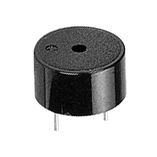
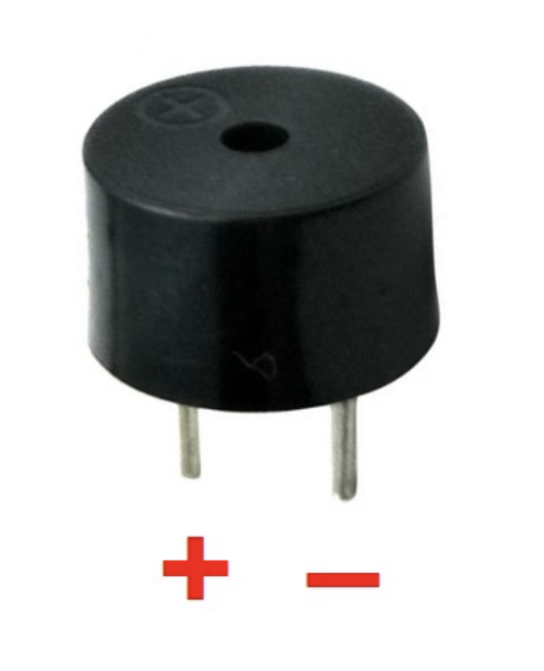
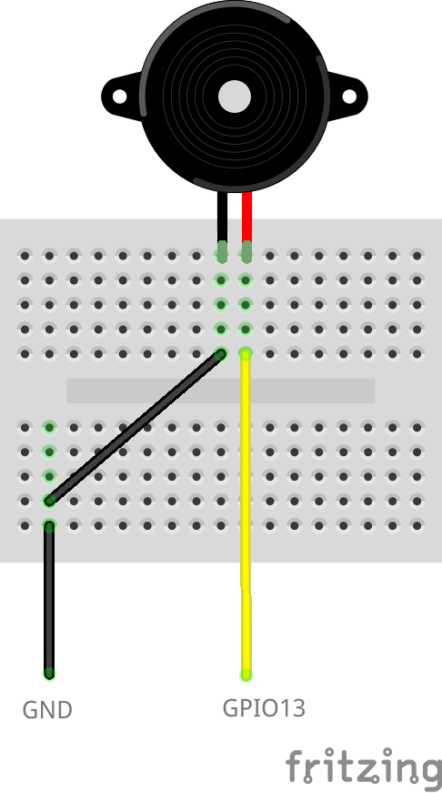

# Piezo Buzzer



https://en.wikipedia.org/wiki/Piezoelectric_speaker

## Pinout



## Wiring Scheme



## Example Code

```cpp
#include <Arduino.h>

#define BUZZER_PIN 18
#define NOTE_C4 262
#define NOTE_G3 196
#define NOTE_A3 220
#define NOTE_B3 247

int melody[] = {
    NOTE_C4, NOTE_G3, NOTE_G3, NOTE_A3, NOTE_G3, 0, NOTE_B3, NOTE_C4};

int noteDurations[] = {
    4, 8, 8, 4, 4, 4, 4, 4};

void setup()
{
    for (int thisNote = 0; thisNote < 8; thisNote++)
    {
        int noteDuration = 1000 / noteDurations[thisNote];
        int pauseBetweenNotes = noteDuration * 1.30;

        tone(BUZZER_PIN, melody[thisNote], noteDuration);
        delay(pauseBetweenNotes);
        noTone(BUZZER_PIN);
    }
}

void loop()
{
}
```

For ESP32 the `tone` and `noTone` functions are not available, but the sketch below shows another implementation.

```cpp
#include <Arduino.h>

// Change this depending on where you put your piezo buzzer
const int TONE_OUTPUT_PIN = 18;

// The ESP32 has 16 channels which can generate 16 independent waveforms
// We'll just choose PWM channel 0 here
const int TONE_PWM_CHANNEL = 0;

void setup()
{
    // ledcAttachPin(uint8_t pin, uint8_t channel);
    ledcAttachPin(TONE_OUTPUT_PIN, TONE_PWM_CHANNEL);
}

void loop()
{
    // Plays the middle C scale
    ledcWriteNote(TONE_PWM_CHANNEL, NOTE_C, 4);
    delay(500);
    ledcWriteTone(TONE_PWM_CHANNEL, 800);
    delay(500);
}
```
