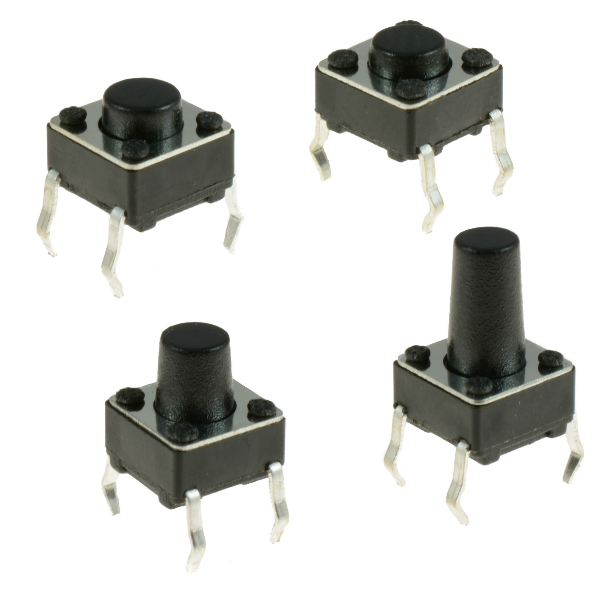
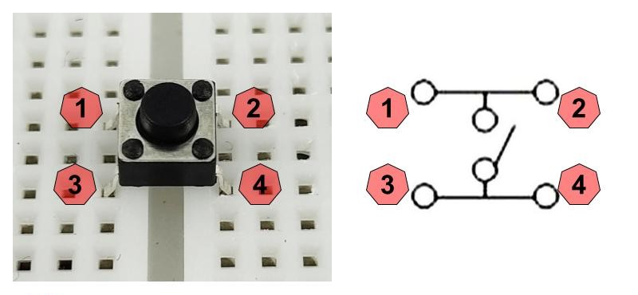
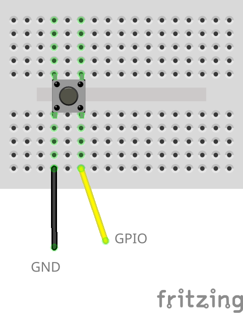
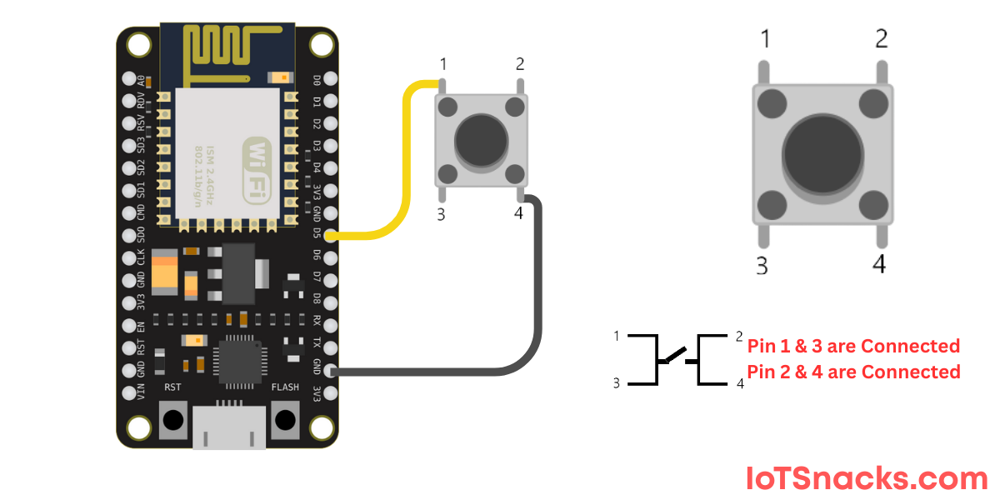
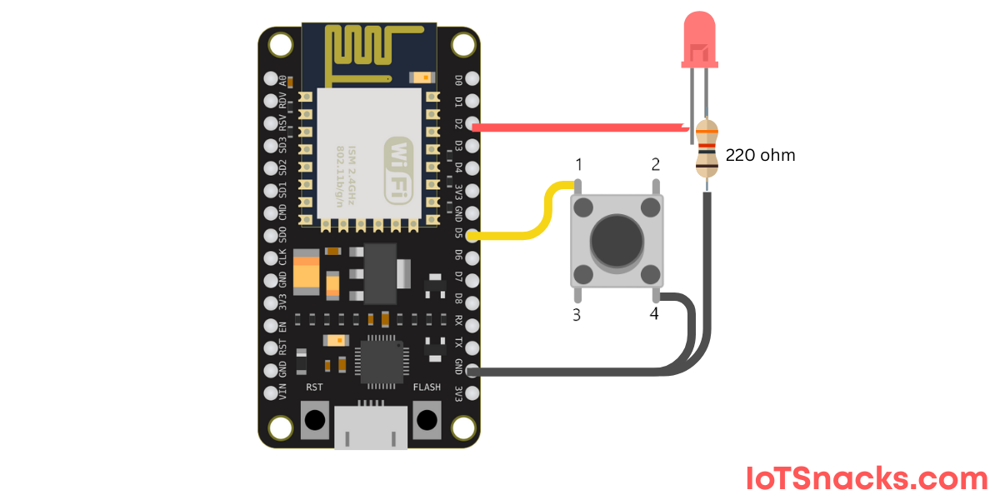

# Mini Push Button



Inspired by https://www.iotsnacks.com/esp8266-tutorials/push-button-with-esp8266-nodemcu-wemos-d1-mini.

## Pinout


You just need to connect only 2 pins to use the push button. Don’t need to use all 4 pins.
Pin 1 is always internally connected to pin 2 and same goes for pin 3 and pin 4.
To use the push button normally, you can either use one of these combinations:

- Pin 1 - 3
- Pin 1 - 4
- Pin 2 - 3
- Pin 2 - 4

## Wiring Scheme



## Example Code

### What does this button do?



```cpp
#include <Arduino.h>

int buttonPin = 14;
int buttonState = 0;

void setup() {
  Serial.begin(115200);
  pinMode(buttonPin, INPUT_PULLUP); // Internal pull-up resistor
}

void loop() {
  buttonState = digitalRead(buttonPin);  // Read button

  if (buttonState == LOW) {  // Pressed
    Serial.println("Button Pressed!");
  }

  delay(200);
}
```

### LED there be light!



```cpp
int buttonPin = 13;  // Button pin
int ledPin = 4;     // LED pin (GPIO4)
int buttonState = 0;

void setup() {
  pinMode(buttonPin, INPUT_PULLUP);
  pinMode(ledPin, OUTPUT);
}

void loop() {
  buttonState = digitalRead(buttonPin);

  if (buttonState == LOW) {  // Button pressed
    digitalWrite(ledPin, HIGH);  // LED ON
  } else {
    digitalWrite(ledPin, LOW);   // LED OFF
  }
}
```

or

```cpp
int buttonPin = 13;
int ledPin = 5;
int buttonState;
int lastButtonState = HIGH;
bool ledState = LOW;

void setup() {
  pinMode(buttonPin, INPUT_PULLUP);
  pinMode(ledPin, OUTPUT);
}

void loop() {
  buttonState = digitalRead(buttonPin);

  if (buttonState == LOW && lastButtonState == HIGH) {
    ledState = !ledState;  // Toggle LED state
    digitalWrite(ledPin, ledState);
    delay(200); // Debounce delay
  }

  lastButtonState = buttonState;
}
```
