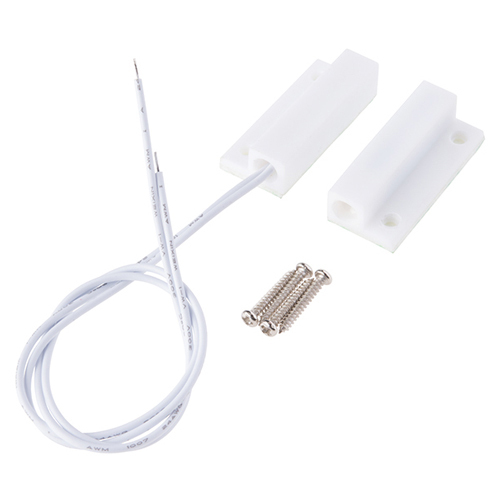
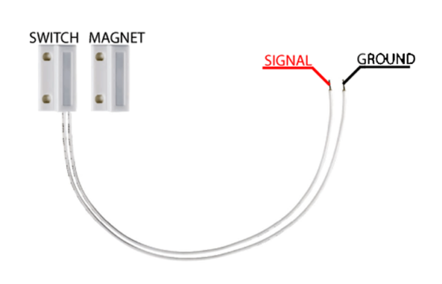
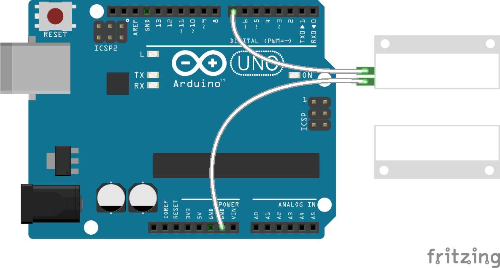

# Magnetic Reed Switch



https://en.wikipedia.org/wiki/Reed_switch

## Pinout



## Wiring Scheme



## Example Code

```cpp
#include <Arduino.h>

#define DOOR_SENSOR_PIN 7

int value = 0;
int doorState; // store the state of the door (open/closed)
int previousState = LOW; // hold the previous state

void setup()
{
    Serial.begin(115200);
    pinMode(DOOR_SENSOR_PIN, INPUT_PULLUP);
}

void loop()
{
    doorState = digitalRead(DOOR_SENSOR_PIN); // read state

    if (doorState == HIGH && previousState != HIGH)
    {
        previousState = doorState;
        Serial.println("The door/window is open");
    }

    if (doorState == LOW && previousState != LOW)
    {
        previousState = doorState;
        Serial.println("The door/window is closed");
    }
}
```
