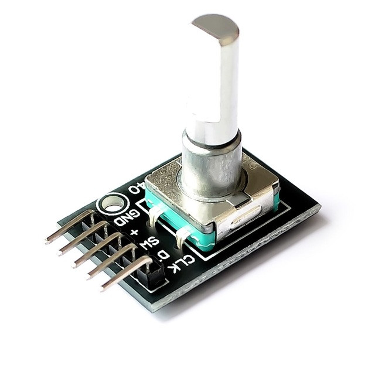
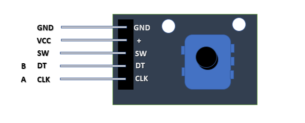
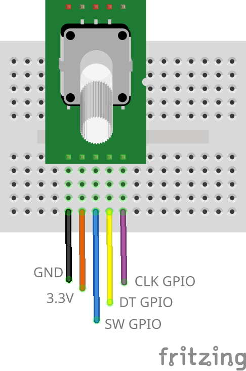

# Rotary Encoder Switch

https://en.wikipedia.org/wiki/Rotary_encoder



## Pinout



## Wiring Scheme



## Libraries

ezButton by ArduinoGetStarted -> https://github.com/ArduinoGetStarted/button

Open Arduino IDE Library Manager and search for **ezButton** and click install.

For PlatformIO include the following in the `lib_deps` section:

```
arduinogetstarted/ezButton@^1.0.6
```

Ref: https://registry.platformio.org/libraries/arduinogetstarted/ezButton

## Example Code

```cpp
#include <Arduino.h>
#include <ezButton.h> // the library to use for SW pin

#define CLK_PIN 25 // GPIO25 connected to the rotary encoder's CLK pin
#define DT_PIN 26  // GPIO26 connected to the rotary encoder's DT pin
#define SW_PIN 27  // GPIO27 connected to the rotary encoder's SW pin

#define DIRECTION_CW 0  // clockwise direction
#define DIRECTION_CCW 1 // counter-clockwise direction

    int counter = 0;
int direction = DIRECTION_CW;
int CLK_state;
int prev_CLK_state;

ezButton button(SW_PIN); // create ezButton object that attach to pin 7;

void setup()
{
    Serial.begin(115200);

    // configure encoder pins as inputs
    pinMode(CLK_PIN, INPUT);
    pinMode(DT_PIN, INPUT);
    button.setDebounceTime(50); // set debounce time to 50 milliseconds

    // read the initial state of the rotary encoder's CLK pin
    prev_CLK_state = digitalRead(CLK_PIN);
}

void loop()
{
    button.loop(); // MUST call the loop() function first

    // read the current state of the rotary encoder's CLK pin
    CLK_state = digitalRead(CLK_PIN);

    // If the state of CLK is changed, then pulse occurred
    // React to only the rising edge (from LOW to HIGH) to avoid double count
    if (CLK_state != prev_CLK_state && CLK_state == HIGH)
    {
        // if the DT state is HIGH
        // the encoder is rotating in counter-clockwise direction => decrease the counter
        if (digitalRead(DT_PIN) == HIGH)
        {
            counter--;
            direction = DIRECTION_CCW;
        }
        else
        {
            // the encoder is rotating in clockwise direction => increase the counter
            counter++;
            direction = DIRECTION_CW;
        }

        Serial.print("Rotary Encoder:: direction: ");
        if (direction == DIRECTION_CW)
            Serial.print("Clockwise");
        else
            Serial.print("Counter-clockwise");

        Serial.print(" - count: ");
        Serial.println(counter);
    }

    // save last CLK state
    prev_CLK_state = CLK_state;

    if (button.isPressed())
    {
        Serial.println("The button is pressed");
    }
}
```
