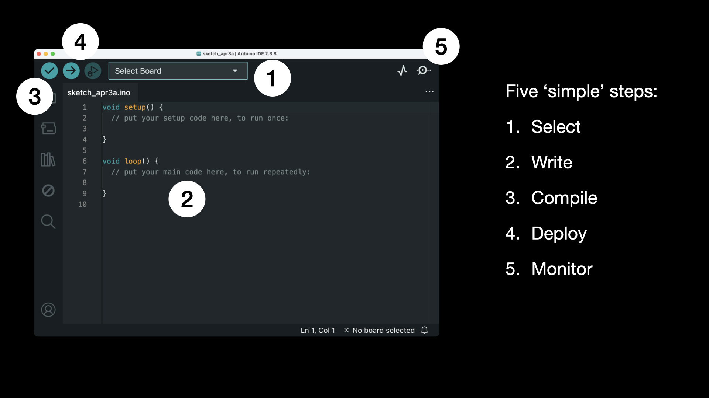

# Microcontroller Workshop

Having fun with microcontrollers like ESPs, Arduinos, Picos etc.

https://en.wikipedia.org/wiki/Microcontroller

Next to this repository, you'll find a lot of information on the world wide web. Some great places to start looking for examples and inspiration:

- https://www.iotsnacks.com
- https://hackaday.io
- https://esp32io.com
- https://randomnerdtutorials.com
- ...

## Boxes

For the workshop, some sample boxes were assembled, ready for exploration and experimenting. They are listed in this [section](./Boxes).

> TODO? Create shopping list

Of course the explanation on how to develop, program a peripheral, and putting it into practice is not bound to having these boxes available. It can be seen as a generic reference.

## Development

Three environments to develop applications for microcontrollers are:

- [PlatformIO](https://platformio.org)
- [Arduino IDE](https://www.arduino.cc/en/software/)
- [Sloeber](https://eclipse.baeyens.it)

Although there are many IDE integrations for PlatformIO, Visual Studio Code is the most seen one, easily accessible via the extension manager.

The Arduino IDE targets the Arduino boards of course, but supports other flavours (like Expressiff as well)

Next to the UI differences, you might notice that PlatformIO uses `.cpp` as a file extension versus `.ino` on the Arduino IDE 😉

The odd one out being Sloeber which is built on top of [Eclipse IDE](https://eclipseide.org), now part of the [Eclipse Foundation](https://www.eclipse.org). A very flexible and solid IDE, but over the years it lost its market share to Jetbrains and Visual Studio.

Given the 'happy flow', programming microcontrollers happens in five ‘simple’ steps:

- [Select](Arduino/README.md#Select) microcontroller
- [Write](Arduino/README.md#Write) code
- [Compile](Arduino/README.md#Compile) code
- [Deploy](Arduino/README.md#Deploy) to the microcontroller
- [Monitor](Arduino/README.md#Monitor) output

In the Arduino IDE, you'll find them here:

These steps are explained in more detail in this [section](Arduino/README.md).

## Glossary

[A](#A) B [C](#C) D E F [G](#G) H [I](#I) J K [L](#L) [M](#M) N O [P](#P) Q R S T [U](#U) [V](#V) W X Y Z

#### A

- [Anode](https://en.wikipedia.org/wiki/Anode) in a diode is positively charged - see also: https://www.geeksforgeeks.org/chemistry/cathode-and-anode/

#### C

- [Cathode](https://en.wikipedia.org/wiki/Cathode) in a diode is negatively charged - see also: https://www.geeksforgeeks.org/chemistry/cathode-and-anode/

#### G

- GPIO - [General-Purpose Input/Output](https://en.wikipedia.org/wiki/General-purpose_input/output)

#### I

- I2C or IIC - [Inter-Integrated Circuit](https://en.wikipedia.org/wiki/I2C)
- IoT - [Internet of Things](https://en.wikipedia.org/wiki/Internet_of_things)

#### L

- LDR - [Light Dependent Resistor](https://en.wikipedia.org/wiki/Photoresistor)
- LED - [Light Emitting Diode](https://en.wikipedia.org/wiki/Light-emitting_diode)
- LLC - [Logic Level Converter](https://en.wikipedia.org/wiki/Level_shifter) or Level Shifter

#### M

- MQTT - [Message Queuing Telemetry Transport](https://en.wikipedia.org/wiki/MQTT)

#### P

- PCB - [Printed Circuit Board](https://en.wikipedia.org/wiki/Printed_circuit_board)

#### U

- UART - [Universal Asynchronous Receiver/Transmitter](https://en.wikipedia.org/wiki/Universal_asynchronous_receiver-transmitter)
  

#### V

- VCC - [Voltage at the Common Collector](https://en.wikipedia.org/wiki/IC_power-supply_pin)
- VIN - [Voltage Input](https://en.wikipedia.org/wiki/Voltage_divider)
